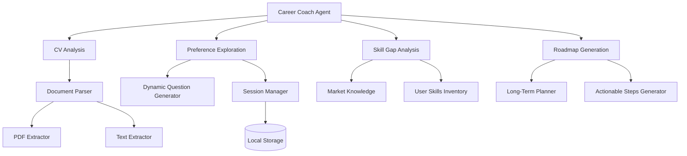
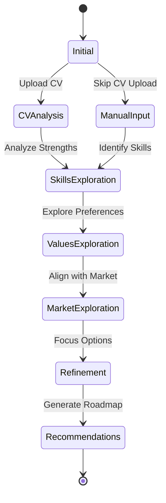

# Career Coach Agent

This document details the architecture and functionality of the AI Career Coach component, which is responsible for analyzing user CVs, conducting career preference exploration, and generating personalized career roadmaps.

## Component Overview

The Career Coach Agent is built on the OpenAI Agents SDK and leverages GPT-4o to provide intelligent career guidance through a conversational interface.



## Conversation Flow

The Career Coach guides users through a structured conversation flow to gather information and provide personalized guidance:



## Core Functions and Tools

The Career Coach Agent utilizes several function tools to manage the conversation and provide insights:

### 1. CV Data Extraction

The `extract_cv_data` function analyzes a user's CV to extract structured information including:
- Personal information
- Skills (technical and soft)
- Work experience
- Education
- Certifications
- Projects
- Interests

### 2. Session Data Management

The `update_session_data` function maintains the state of the conversation, tracking:
- Current exploration phase
- Identified strengths
- Identified skill gaps
- Explored career paths
- Conversation history

### 3. Dynamic Question Generation

The `get_next_question` function generates contextually relevant questions based on:
- Current exploration phase
- Previous responses
- Identified skills and preferences
- Potential career paths

### 4. Career Roadmap Generation

The `generate_career_roadmap` function creates a personalized development plan including:
- Short-term goals (6-12 months)
- Medium-term goals (1-3 years)
- Long-term vision (3-5+ years)
- Prioritized skills to develop
- Recommended learning resources
- Networking strategies
- Success metrics

### 5. Skill Gap Analysis

The `analyze_skill_gaps` function compares the user's current skills with requirements for target roles, identifying:
- Essential skills for the target role
- Existing relevant skills
- Critical skill gaps
- Learning recommendations
- Estimated time investment for skill development

## Exploration Phases

The Career Coach guides users through five key phases of career exploration:

1. **Initial Phase**: Gather baseline information and analyze CV
2. **Skills Phase**: Explore technical and soft skills, identify strengths and gaps
3. **Values Phase**: Understand career priorities (work-life balance, salary, growth, etc.)
4. **Market Phase**: Align profile with current market opportunities and trends
5. **Refinement Phase**: Focus options and create specific action plans

## Session Persistence

User session data is persisted to local storage, allowing conversations to continue across multiple sessions. The session data includes:

- Conversation history
- Analyzed documents
- Current exploration phase
- Identified strengths and gaps
- Explored career paths

## Agent Implementation

The Career Coach Agent is implemented in Python using the OpenAI Agents SDK, with the core agent being initialized with specific instructions and tools:

```python
self.agent = Agent(
    name="Career Coach",
    model="gpt-4o",
    instructions=self._get_base_instructions(),
    tools=[
        self.extract_cv_data,
        self.update_session_data,
        self.get_session_summary,
        self.save_user_preferences
    ]
)
```

This configuration enables the agent to maintain context, utilize tools for specific tasks, and guide users through a structured coaching process.
