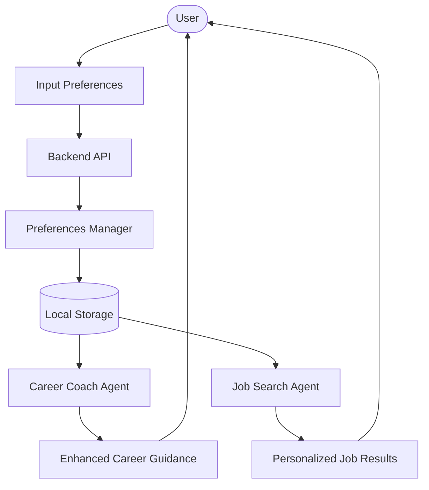
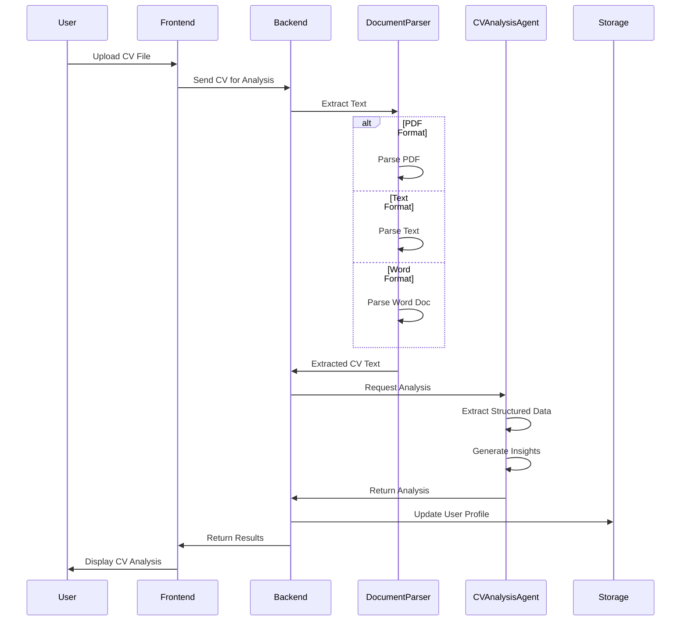
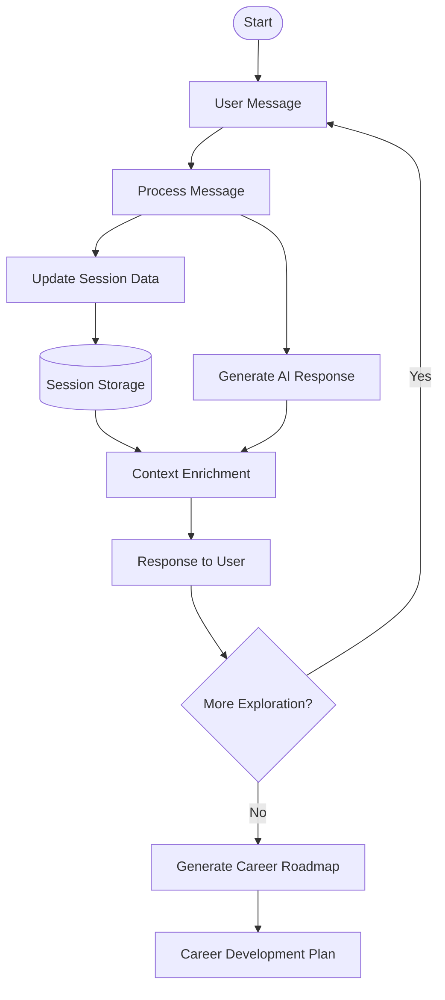
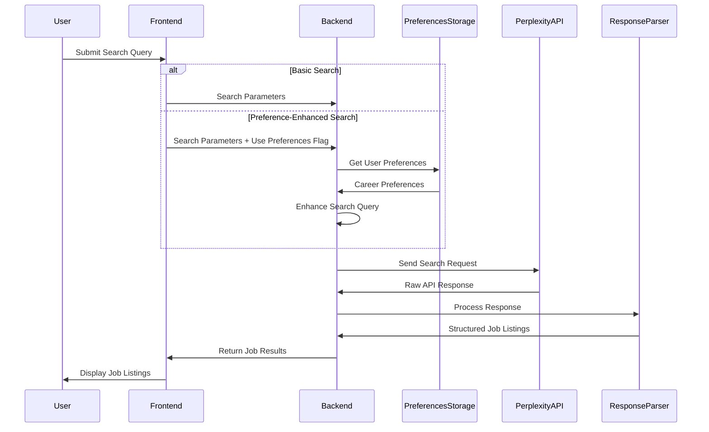
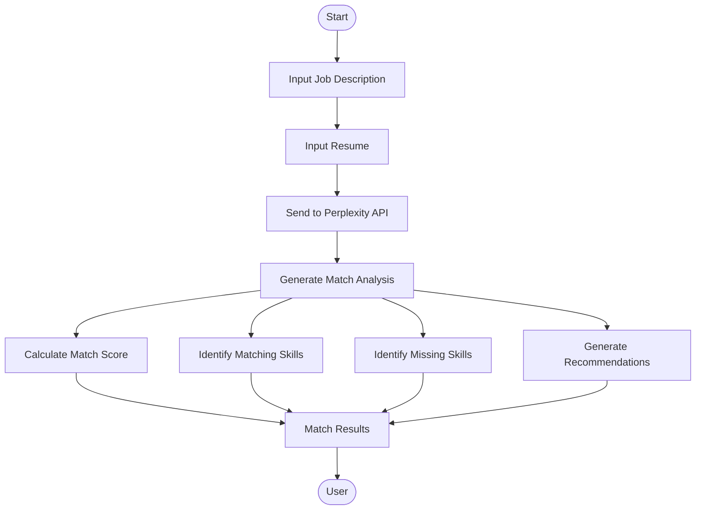
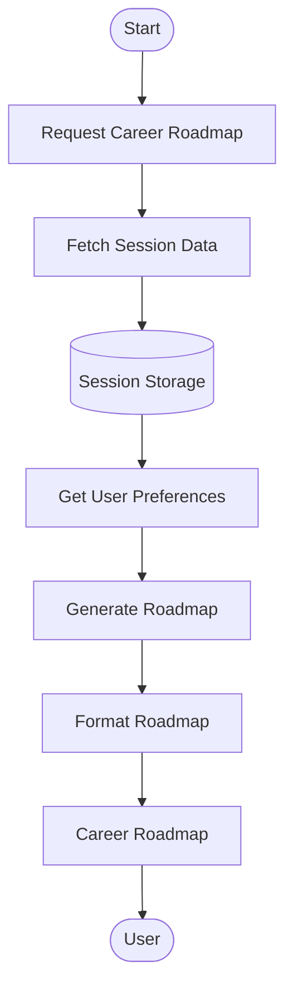
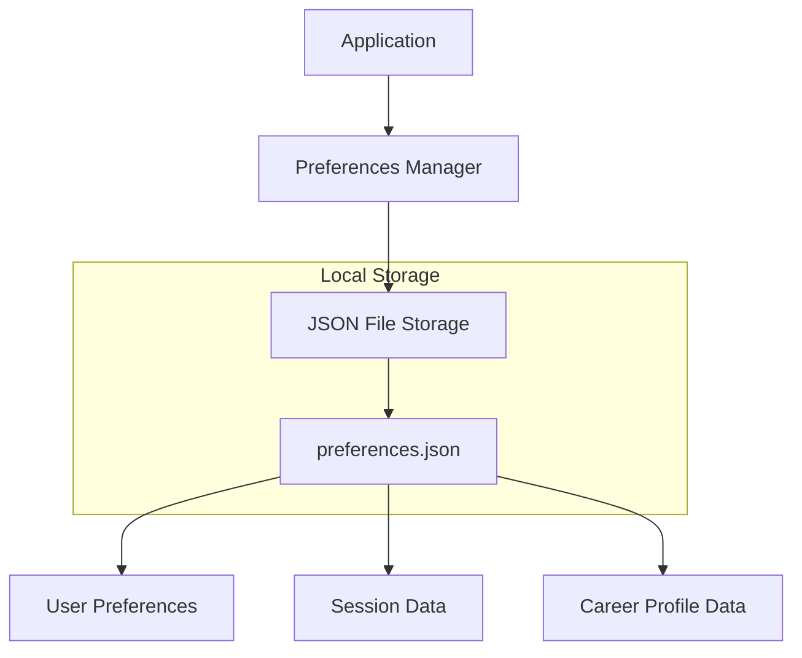
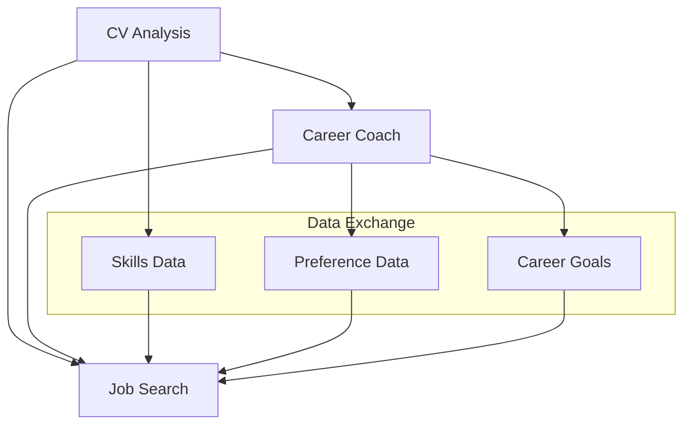

# Data Flows

This document details the key data flows within the AI Career Coach & Job Search Agent application, illustrating how information moves between components and is processed throughout the system.

## User Preference Data Flow

User preferences form the foundation of personalized experiences in both the Job Search and Career Coach components.



### Preference Storage Process

1. User inputs career preferences through the UI
2. Frontend sends preferences to the backend API
3. `PreferencesManager` validates and processes the data
4. Preferences are stored in local JSON storage
5. On subsequent requests, preferences are loaded to enhance services

### Preference Data Structure

```json
{
  "technicalSkills": ["Python", "Data Analysis", "Machine Learning"],
  "softSkills": ["Communication", "Problem Solving"],
  "careerGoals": "Transition into a data science role in fintech",
  "jobTypes": ["Full-time", "Remote"],
  "workValues": ["Work-life balance", "Growth opportunities"],
  "careerCoachSession": {
    "current_exploration_phase": "refinement",
    "identified_strengths": ["Python", "SQL", "Data Analysis"],
    "identified_gaps": ["Deep Learning", "Cloud Infrastructure"],
    "explored_career_paths": ["Data Scientist", "Machine Learning Engineer"]
  }
}
```

## CV Analysis Flow

The CV analysis process extracts and structures information from user-uploaded documents.



### Data Transformation

1. **Input**: Raw CV document (PDF, DOCX, TXT)
2. **Processing**: 
   - Text extraction from document
   - Parsing into structured data
   - AI analysis of career relevance
3. **Output**: Structured CV data with insights
   ```json
   {
     "cv_data": {
       "personal_information": { ... },
       "skills": {
         "technical": [ ... ],
         "soft": [ ... ]
       },
       "work_experience": [ ... ],
       "education": [ ... ],
       "certifications": [ ... ]
     },
     "analysis": "Detailed analysis text...",
     "session_summary": { ... }
   }
   ```

## Career Coaching Conversation Flow

The Career Coach conducts a dynamic conversation to explore the user's preferences and generate insights.



### Session Data Flow

1. User sends a message to the Career Coach
2. Message is processed, and session data is updated
3. Updated context is used to enrich the next response
4. AI generates a contextually relevant response
5. Session data is persisted between interactions
6. Accumulated data is used for roadmap generation

## Job Search Data Flow

The Job Search process involves transforming user queries into structured job listings.



### Search Query Enhancement

When a user opts to use preferences in search:

1. Basic search parameters are extracted (keywords, location, etc.)
2. User preferences are retrieved from storage
3. Search query is enhanced with:
   - Technical skills from user profile
   - Preferred job types
   - Career goals context
4. Enhanced query is sent to Perplexity API
5. Results are processed and returned

## Resume-Job Matching Flow

The system can analyze how well a user's resume matches a specific job description.



### Match Analysis Data

The resume-job matching produces a detailed analysis:

```json
{
  "match_score": 78,
  "matching_skills": [
    "Python programming",
    "Data analysis",
    "SQL database management",
    "Project management"
  ],
  "missing_skills": [
    "TensorFlow experience",
    "AWS infrastructure",
    "Agile certification"
  ],
  "recommendations": [
    "Highlight your Python and SQL experience more prominently",
    "Add specifics about data analysis projects",
    "Consider obtaining AWS certification",
    "Include metrics from previous project management work"
  ]
}
```

## Career Roadmap Generation Flow

The Career Roadmap generation process uses accumulated session data to create a personalized development plan.



### Roadmap Data Sources

The roadmap generation leverages multiple data sources:

1. **Session Conversation History**: Previous discussions with the Career Coach
2. **User Preferences**: Explicitly stated career goals and preferences
3. **CV Analysis**: Skills and experience extracted from the user's CV
4. **Identified Strengths**: Skills recognized through conversation
5. **Identified Gaps**: Skill gaps noted during career exploration
6. **Explored Career Paths**: Career directions discussed

### Roadmap Structure

The generated roadmap follows a structured format:

```
# PERSONALIZED CAREER ROADMAP

## Short-term Goals (6-12 months)
- Goal 1: [Specific actionable goal]
- Goal 2: [Specific actionable goal]
...

## Medium-term Goals (1-3 years)
- Goal 1: [Specific actionable goal]
- Goal 2: [Specific actionable goal]
...

## Long-term Vision (3-5+ years)
[Vision statement and long-term aspirations]

## Skills to Develop
1. [Priority skill 1]
   - Resource: [Learning resource]
   - Expected timeline: [Time estimate]

2. [Priority skill 2]
   - Resource: [Learning resource]
   - Expected timeline: [Time estimate]
...

## Networking Strategy
[Personalized networking recommendations]

## Success Metrics
[Measurable indicators of progress]
```

## Data Persistence

The application uses a simple file-based persistence system for storing user data.



### File Structure

User data is stored in a JSON file with the following organization:

```
~/.jobSearchAgent/
└── preferences.json
```

The preferences file contains a dictionary where:
- Keys are user IDs
- Values are user preference objects

This approach allows for:
- Simple persistence without database setup
- Easy backup and migration
- Offline functionality

## Cross-Component Data Exchange

Several data flows cross between major components of the application:



### Shared Data Benefits

This cross-component data sharing enables:

1. **Skill Recognition**:
   - Skills identified in CV analysis enrich Career Coach conversations
   - Skills discussed with Career Coach enhance job searches

2. **Preference Alignment**:
   - Career Coach insights improve job search relevance
   - Job search results inform Career Coach recommendations

3. **Unified Experience**:
   - Consistent user profile across features
   - Complementary functionality between components

## Security and Privacy Considerations

The data flows in the application have been designed with the following considerations:

1. **Local Storage**: User data is stored locally, not shared with external services
2. **Minimal Data Sharing**: Only necessary information is sent to external APIs
3. **API Key Security**: API keys are stored in environment variables, not in code
4. **No PII Transmission**: Personally identifiable information is kept locally

## Future Data Flow Enhancements

Potential improvements to the application's data flows include:

1. **Database Integration**: Move from file-based to database storage for better scalability
2. **User Authentication**: Add user accounts and secure authentication
3. **Data Export/Import**: Allow users to export their data for backup or transfer
4. **Analytics Pipeline**: Add optional usage analytics for feature improvement
5. **Collaborative Flows**: Enable sharing career roadmaps with mentors or coaches
