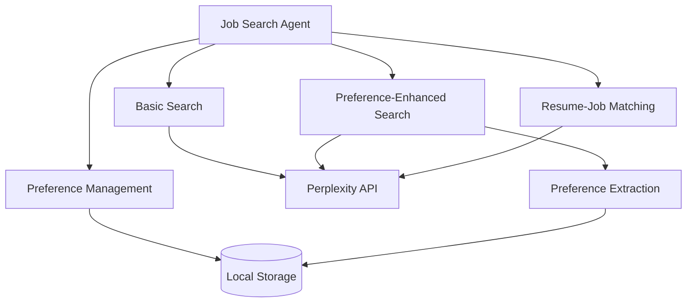
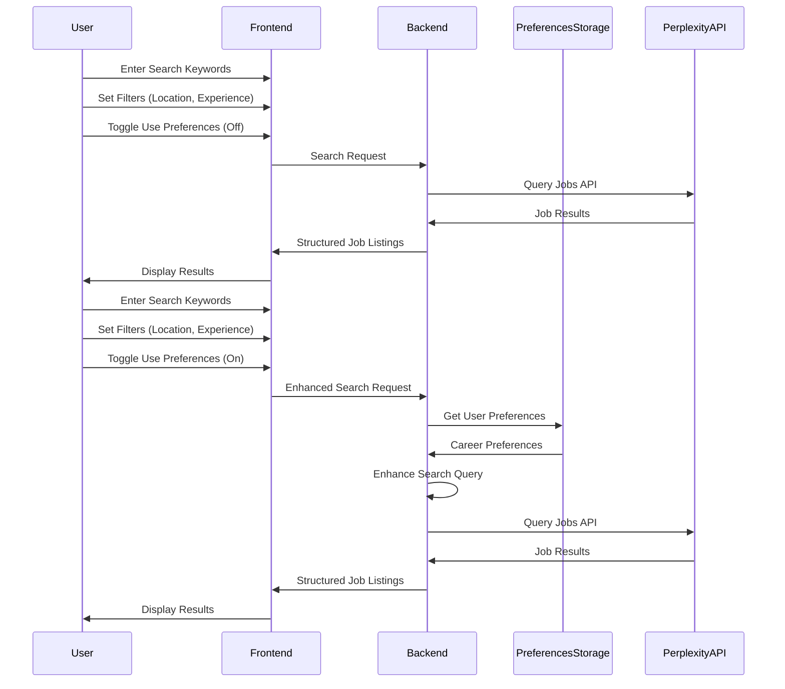
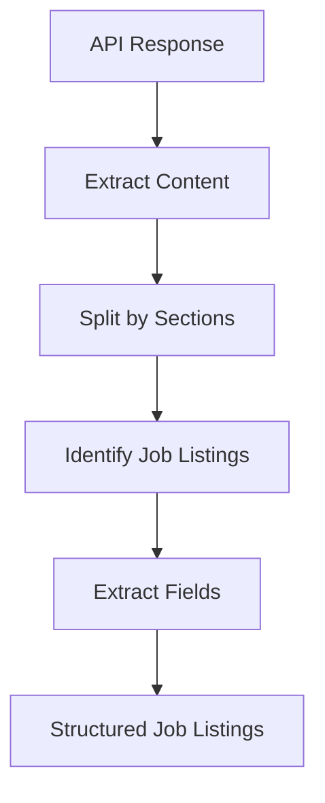

# Job Search Agent

This document details the architecture and functionality of the Job Search Agent component, which is responsible for finding relevant job opportunities by matching user skills, preferences, and experience with available positions.

## Component Overview

The Job Search Agent leverages the Perplexity API to perform intelligent job searches based on user **queries** and preferences.

## Search Process Flow

The Job Search process follows different paths depending on whether the user wants to include their stored preferences:

## Core Functions

The Job Search Agent provides several key functions:

### 1. Basic Job Search

The `search_jobs` function performs searches based on user-provided criteria:
- Keywords (job title, skills, etc.)
- Location (city, state, country, or "remote")
- Experience level (entry, mid, senior)
- Recency (day, week, month)

### 2. Preference-Enhanced Search

The `enhanced_job_search` function augments the basic search with user preferences:
- Automatically includes relevant skills from user profile
- Filters by preferred job types
- Incorporates career goals into search parameters

### 3. Resume-Job Matching

The `analyze_resume_match` function evaluates how well a resume matches a specific job description:
- Calculates a match score (0-100)
- Identifies matching skills
- Highlights missing skills
- Provides recommendations for resume improvement

### 4. Career Preferences Management

The `save_career_preferences` and `get_career_preferences` functions manage user preference data:
- Technical skills
- Soft skills
- Career goals
- Preferred job types
- Work environment preferences

## Job Results Extraction

The Job Search Agent includes logic to parse and structure the results from the Perplexity API:

The `extract_job_listings` function processes the API response to extract structured job listings including:
- Company name
- Job title
- Location
- Salary range (when available)
- Application link
- Key requirements
- Benefits

## Perplexity API Integration

The Job Search Agent interacts with the Perplexity API through a dedicated wrapper class that:
- Handles authentication
- Constructs appropriate search queries
- Processes API responses
- Implements error handling

## Command-Line Interface

The Job Search Agent can be used via a command-line interface, which provides the following commands:
- `search`: Search for job openings
- `match`: Analyze resume match with job description

Each command supports various options for filtering and output format control.

## Integration with Career Coach

The Job Search Agent integrates with the Career Coach by:
- Sharing user preference data
- Using skills identified by the Career Coach to enhance searches
- Aligning job searches with career roadmaps and goals
