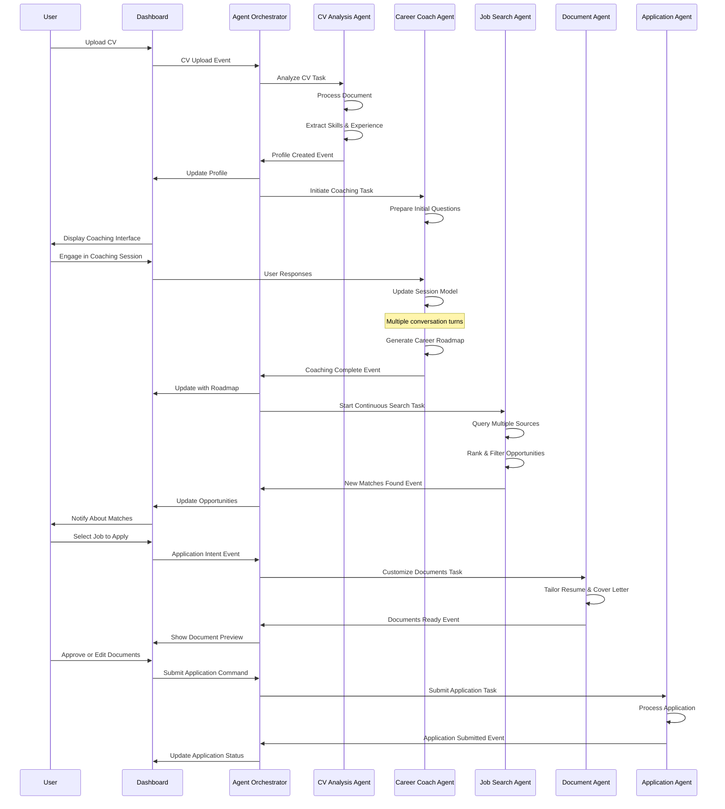

# Multi-Agent Coordination System Design

## Overview
This document outlines the multi-agent coordination system that enables integrated, autonomous operation across the job search platform. This system allows specialized agents to work together seamlessly, creating a cohesive user experience while maintaining separation of concerns.

## Agentic User Flow Coordination

The multi-agent system orchestrates the end-to-end user flow depicted in the agentic job search process diagram. This workflow integrates multiple specialized agents working asynchronously toward shared goals.

### Coordination Mechanisms

The agent coordination system employs several mechanisms to ensure smooth operation across the workflow:

1. **Event-Based Communication**
   - Agents publish events when significant milestones are reached
   - Other agents subscribe to relevant events to trigger dependent actions
   - Decouples agent implementations while maintaining process flow

2. **Shared Context**
   - Common memory system maintains user context across agents
   - Each agent contributes to and consumes from the shared context
   - Enables continuity without direct agent coupling

3. **Task Delegation**
   - Orchestrator delegates specialized tasks to appropriate agents
   - Tasks include required inputs and expected outputs
   - Agents work asynchronously on assigned tasks

4. **Status Reporting**
   - Agents report progress on long-running tasks
   - Status updates flow through to user interface
   - Enables visibility into background processes

## System Architecture

### Core Components

1. **Agent Registry**
   - Central registration system for all agent types
   - Capability declaration and discovery
   - Agent lifecycle management
   - Health monitoring and status tracking

2. **Message Bus**
   - Asynchronous communication channel
   - Message routing and delivery
   - Event publication/subscription
   - Message persistence and recovery

3. **Task Orchestrator**
   - Task distribution and scheduling
   - Priority management
   - Dependency resolution
   - Resource allocation

4. **State Manager**
   - Distributed state management
   - Consistency maintenance
   - Transaction coordination
   - State recovery mechanisms

### Agent Types

1. **CV Analysis Agent**
   - Document parsing and text extraction
   - Skills and experience identification
   - Career trajectory analysis
   - Profile strength assessment
   - Improvement recommendations

2. **Career Coach Agent**
   - Structured conversation management
   - Career goals exploration
   - Values and preferences assessment
   - Skills gap analysis
   - Career roadmap generation

3. **Job Search Agent**
   - Continuous job discovery across sources
   - Semantic job requirement analysis
   - Opportunity ranking and filtering
   - Match quality assessment
   - Job market intelligence gathering

4. **Document Customization Agent**
   - Resume tailoring for specific opportunities
   - Cover letter generation
   - Keyword optimization
   - ATS compatibility assessment
   - Content quality verification

5. **Application Tracking Agent**
   - Application status monitoring
   - Email integration for updates
   - Follow-up scheduling and management
   - Outcome tracking and analysis
   - Application history maintenance

6. **Interview Preparation Agent**
   - Custom question generation
   - Practice session management
   - Response evaluation and feedback
   - Company and role research
   - Strategy recommendations

7. **Learning System Agent**
   - Pattern identification across applications
   - Success factor analysis
   - Strategy optimization
   - Preference inference
   - System improvement recommendations

## Implementation Phases

### Phase 1: Core Agent Framework Integration
- Convert existing services to agent architecture
- Implement Message Bus and Registry
- Create agent protocol implementations
- Develop monitoring infrastructure
- Set up initial CV Analysis and Job Search agents

### Phase 2: Full Agent Lifecycle Implementation
- Implement structured agent lifecycle
- Add Career Coach agent integration
- Create basic shared memory system
- Develop event-based communication
- Implement user dashboard with agent monitoring

### Phase 3: Autonomous Operations
- Implement background job discovery
- Add document customization capabilities
- Create proactive notification system
- Develop application tracking agent
- Implement autonomy level management

### Phase 4: Advanced Capabilities
- Add interview preparation agent
- Implement learning system
- Create sophisticated user controls
- Develop advanced memory and context sharing
- Implement cross-agent optimization strategies

## Success Metrics

1. **Technical Performance**
   - Message delivery latency < 100ms
   - Task distribution efficiency > 95%
   - System uptime > 99.9%
   - Agent response time < 500ms

2. **Reliability**
   - Error recovery rate > 99%
   - Task completion success rate > 98%
   - State consistency maintenance > 99.9%
   - Agent health monitoring coverage 100%

3. **Scalability**
   - Linear performance scaling up to 100 concurrent agents
   - Resource utilization optimization
   - Efficient load distribution
   - Memory usage scaling < O(n)

4. **Agent Autonomy**
   - Successful autonomous job discovery rate > 90%
   - Document customization accuracy > 95%
   - Appropriate autonomy level adherence 100%
   - User satisfaction with agent decisions > 90%

5. **User Experience**
   - Reduction in manual effort > 70%
   - User control effectiveness > 95%
   - System transparency rating > 90%
   - Overall satisfaction with agent assistance > 85%

## Risk Mitigation

1. **System Failures**
   - Comprehensive error handling across all agents
   - Fallback mechanisms for critical functions
   - State recovery procedures with persistent storage
   - Graceful degradation when components fail

2. **Performance Issues**
   - Real-time monitoring of agent activity and resource usage
   - Performance optimization for high-volume message processing
   - Resource management with priority-based allocation
   - Throttling mechanisms for external API calls

3. **Coordination Complexity**
   - Clear protocol definitions between all agents
   - Simplified interaction patterns using standardized messages
   - Comprehensive logging of all inter-agent communication
   - Visualization tools for system state and message flow

4. **Autonomy Concerns**
   - Robust user controls for agent autonomy management
   - Clear visibility into agent actions and reasoning
   - Override mechanisms for all automated decisions
   - Gradual trust building through progressive autonomy

5. **Data Privacy**
   - Strict data access controls for sensitive information
   - Minimal external data sharing with clear user consent
   - Secure storage of user preferences and documents
   - Auditable record of all data access

## Next Steps

1. Convert existing CV Parser to CV Analysis Agent using the agent framework
2. Integrate Career Coach with the agent messaging system
3. Implement continuous job discovery in the Job Search Agent
4. Create the shared memory system for context preservation
5. Develop User Dashboard for agent monitoring and control
6. Implement the autonomy management system 