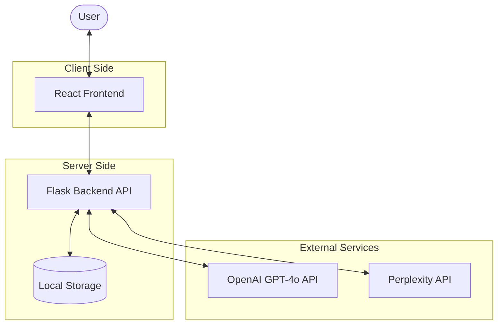
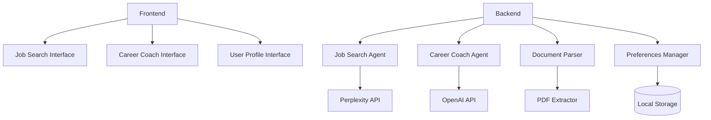
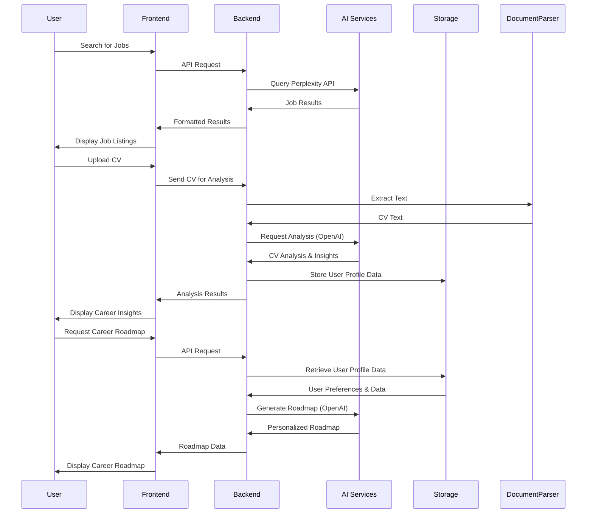

# System Architecture

This document outlines the architecture of the AI Career Coach & Job Search Agent application, illustrating how various components interact to deliver the functionality.

## High-Level Architecture

The application follows a client-server architecture with a React frontend communicating with a Flask backend. The backend leverages AI services through the OpenAI API and Perplexity API to provide job search and career coaching capabilities.

## Component Diagram

The application is organized into the following key components:

## Data Flow Diagram

This diagram illustrates the flow of data through the system for key user actions:

## Technology Stack Details

### Frontend
- **React**: JavaScript library for building the user interface
- **React Router**: For client-side routing
- **Tailwind CSS**: Utility-first CSS framework for styling
- **Framer Motion**: For animations and transitions

### Backend
- **Flask**: Python web framework serving the REST API
- **OpenAI Agents SDK**: For creating and managing AI agents
- **Python libraries**:
  - pypdf: For PDF text extraction
  - requests: For API communication
  - dotenv: For environment variable management

### External Services
- **OpenAI API**: Powers the Career Coach agent using GPT-4o
- **Perplexity API**: Powers the Job Search agent

### Storage
- Local file system for storing user preferences

## Security Considerations

- API keys for OpenAI and Perplexity services are stored in environment variables
- User data is stored locally and not shared with third parties
- File uploads are limited to common document formats for CV analysis
