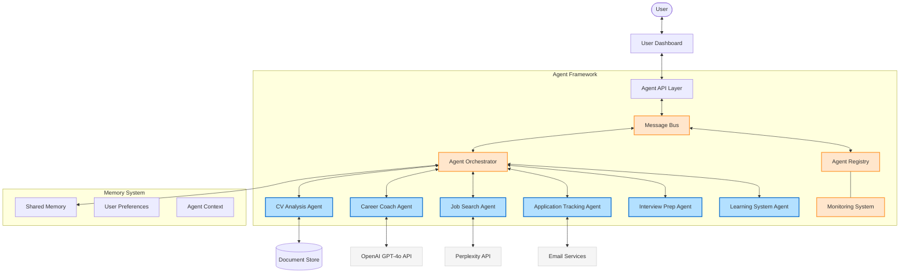
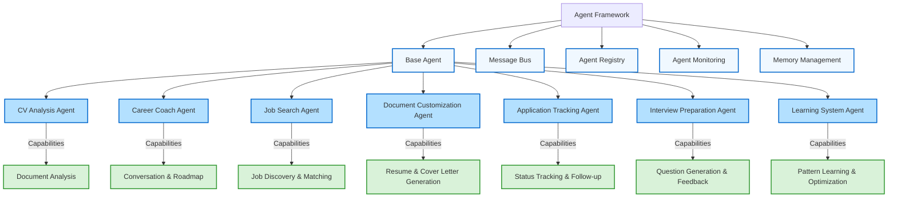
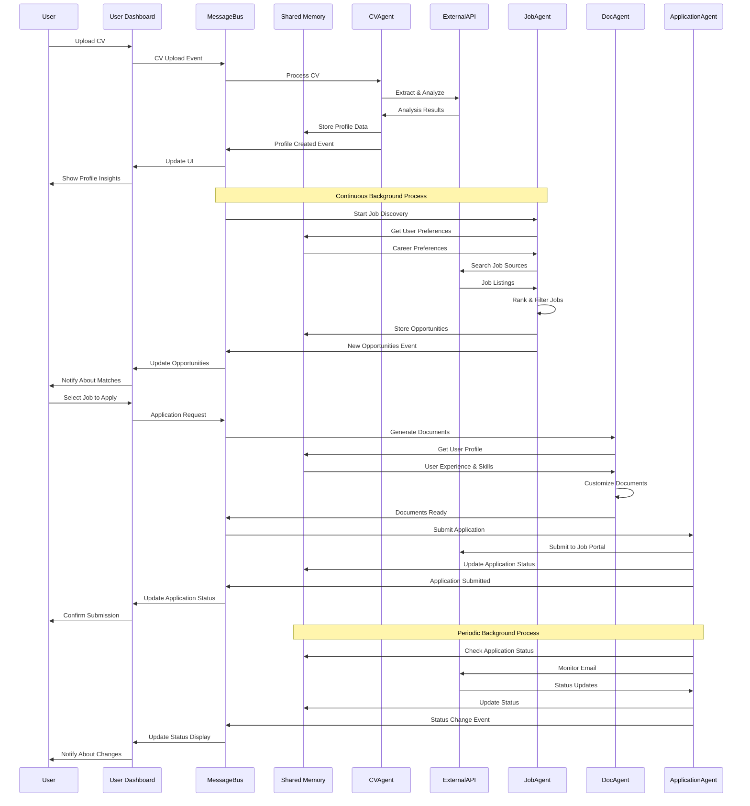
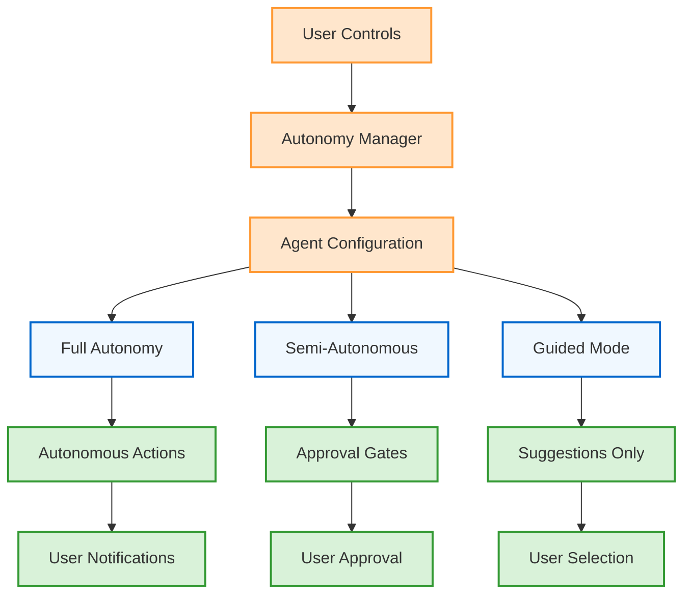

# System Architecture

This document outlines the agentic architecture of the AI Job Search Assistant, illustrating how multiple specialized agents coordinate to deliver a cohesive, autonomous job search experience.

## Agent-Based Architecture

The application follows an agentic architecture with specialized agents communicating through a central message bus. A React frontend interacts with the agent system through a Flask backend API. The system leverages AI services through the OpenAI API and Perplexity API to power different agent capabilities.

## Agent Framework Components

The agent system consists of specialized agents with specific responsibilities:

## Agentic Data Flow

This diagram illustrates the flow of data through the system, emphasizing the autonomous, asynchronous nature of the agent architecture:

## Technology Stack Details

### Agent Framework
- **Base Agent Framework**: Provides core agent capabilities including lifecycle management and messaging
- **Message Bus**: Asynchronous communication system for inter-agent messaging
- **Agent Registry**: Service for agent discovery and management
- **Monitoring System**: Telemetry collection for agent activities and performance
- **Memory Management**: Shared state and context persistence across agents

### Frontend
- **React**: JavaScript library for building the user interface
- **React Router**: For client-side routing
- **Tailwind CSS**: Utility-first CSS framework for styling
- **WebSocket**: For real-time communication with the agent system
- **Framer Motion**: For animations and transitions

### Backend Integration
- **Flask**: Python web framework serving the REST and WebSocket APIs
- **OpenAI Agents SDK**: For creating and managing AI agents
- **Python libraries**:
  - pypdf: For PDF text extraction
  - asyncio: For asynchronous agent operations
  - requests: For API communication
  - websockets: For real-time notifications
  - dotenv: For environment variable management

### External Services
- **OpenAI API**: Powers multiple agents including Career Coach using GPT-4o
- **Perplexity API**: Powers the Job Search agent for opportunity discovery
- **Email Services**: For application tracking and status monitoring

### Storage
- **Document Store**: For CV, resume, and cover letter storage and versioning
- **Preference Store**: For user preferences and settings
- **Agent Memory**: For agent state and context management

## Agent Autonomy Control

The system provides a flexible autonomy management framework that allows users to control the level of agent independence:

The autonomy levels are defined as:

1. **Full Autonomy Mode**: Agents operate independently with minimal user intervention
   - Automatic job discovery and matching
   - Automatic document customization
   - Automated application tracking
   - User is notified of significant events and outcomes

2. **Semi-Autonomous Mode**: Agents perform routine tasks but seek approval for significant actions
   - Autonomous research and analysis
   - User approves job applications
   - User confirms document customizations
   - System manages follow-up with user approval

3. **Guided Mode**: Agents suggest actions but do not act without user initiation
   - Recommendations for jobs to apply to
   - Suggestions for resume customizations
   - Proposed follow-up actions
   - User initiates all external actions

Users can set global autonomy preferences or configure autonomy levels for individual agents based on their comfort level.

## Security Considerations

- API keys for OpenAI and Perplexity services are stored in environment variables
- User data is stored locally and not shared with third parties
- File uploads are limited to common document formats for CV analysis
- User has explicit control over agent autonomy levels
- All agent actions are logged for transparency
