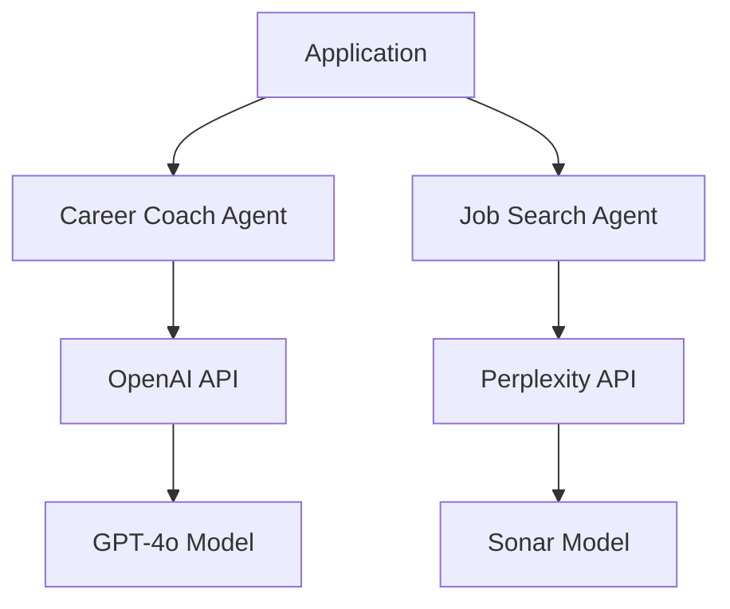

# AI Service Integration Guide

This guide explains how the AI Career Coach & Job Search Agent integrates with external AI services, specifically the OpenAI API and Perplexity API. It provides developers with the necessary information to understand, maintain, and extend these integrations.

## Overview of AI Integrations

The application uses two main AI services:

1. **OpenAI API (GPT-4o)**: Powers the Career Coach Agent with conversational AI capabilities, CV analysis, and roadmap generation.

2. **Perplexity API**: Powers the Job Search Agent with up-to-date job search capabilities and enhanced web search functionality.



## OpenAI Integration

### Authentication and Setup

The OpenAI integration is managed through the OpenAI Agents SDK:

```python
from agents import Agent, Runner, function_tool
```

Authentication is handled using an API key stored in environment variables:

```python
# In career_coach_agent.py
def __init__(self, api_key=None, user_id=None):
    # Set API key
    if api_key:
        os.environ["OPENAI_API_KEY"] = api_key
```

### Agent Configuration

The Career Coach Agent is initialized with:

```python
self.agent = Agent(
    name="Career Coach",
    model="gpt-4o",
    instructions=self._get_base_instructions(),
    tools=[
        self.extract_cv_data,
        self.update_session_data,
        self.get_session_summary,
        self.save_user_preferences
    ]
)
```

Key components:
- **name**: Identifies the agent
- **model**: Specifies the GPT-4o model
- **instructions**: Provides the base prompt for the agent
- **tools**: Function tools the agent can use

### Function Tools

Function tools are methods decorated with `@function_tool` that the AI can call:

```python
@function_tool
def extract_cv_data(self, cv_text: str) -> Dict[str, Any]:
    """
    Extract and analyze key information from a CV.
    
    Args:
        cv_text (str): The full text of the user's CV.
        
    Returns:
        dict: Structured data extracted from the CV.
    """
    # Implementation...
```

These tools enable the AI to:
- Extract data from CVs
- Update session information
- Generate summaries
- Save user preferences

### Running the Agent

The agent is run using the Runner utility:

```python
# Asynchronous execution
result = await Runner.run(self.agent, context)

# Synchronous execution
result = Runner.run_sync(self.agent, context)
```

### Error Handling

OpenAI API errors are handled in try/except blocks:

```python
try:
    result = await Runner.run(self.agent, context)
    return {
        "response": result.final_output,
        "session_summary": self.get_session_summary()
    }
except Exception as e:
    return {"error": str(e)}
```

## Perplexity API Integration

### Authentication and Setup

The Perplexity API integration is managed through a custom wrapper class:

```python
# In perplexity.py
class PerplexityAPI:
    BASE_URL = "https://api.perplexity.ai"
    
    def __init__(self, api_key=None):
        self.api_key = api_key or os.getenv("PERPLEXITY_API_KEY")
        if not self.api_key:
            raise ValueError("Perplexity API key is required")
        
        self.headers = {
            "Authorization": f"Bearer {self.api_key}",
            "Content-Type": "application/json"
        }
```

### Making API Requests

Requests to the Perplexity API are made using the `search` method:

```python
def search(self, query, search_recency_filter=None):
    """
    Perform a search request to the Perplexity API.
    """
    url = f"{self.BASE_URL}/chat/completions"
    
    messages = [
        {
            "role": "system",
            "content": "You are a helpful AI assistant specialized in job searching."
        },
        {
            "role": "user",
            "content": query
        }
    ]
    
    payload = {
        "model": "sonar",
        "messages": messages,
        "max_tokens": 1024,
        "temperature": 0.2
    }
    
    if search_recency_filter:
        payload["search_recency_filter"] = search_recency_filter
        
    response = requests.post(url, json=payload, headers=self.headers)
    response.raise_for_status()
    
    return response.json()
```

### Job Search Query Construction

The Job Search Agent constructs detailed search queries:

```python
# In agent.py
def search_jobs(self, keywords, location=None, experience_level=None, recency="week"):
    query_parts = [keywords]
    
    if location:
        query_parts.append(f"in {location}")
    
    if experience_level:
        query_parts.append(f"{experience_level} level")
    
    query = f"Find job openings for {' '.join(query_parts)}"
    
    # Add instructions for structured results
    query += ". Please provide a list of relevant job postings with company name, ..."
    
    # Perform the search
    response = self.api.search(query, search_recency_filter=recency)
    
    return response
```

### Parsing API Responses

The `extract_job_listings` method processes and structures the API response:

```python
def extract_job_listings(self, api_response):
    """
    Extract job listings from the API response in a structured format.
    """
    try:
        # Extract content from response
        if "choices" in api_response and len(api_response["choices"]) > 0:
            content = api_response["choices"][0]["message"]["content"]
            
            # Parse content into structured job listings
            job_listings = []
            # ... parsing logic ...
            
            return job_listings
        
        return {"error": "No valid response content found"}
        
    except Exception as e:
        return {"error": str(e), "raw_response": api_response}
```

### Error Handling

Perplexity API errors are handled with try/except blocks and response status checks:

```python
if response.status_code != 200:
    print(f"Error: {response.status_code}")
    print(f"Response: {response.text}")
    
response.raise_for_status()  # Raise an exception for HTTP errors
```

## Implementing New AI Features

### Adding a New OpenAI Agent Tool

To add a new capability to the Career Coach Agent:

1. Define a new method with the `@function_tool` decorator:

```python
@function_tool
def analyze_industry_trends(self, industry: str) -> Dict[str, Any]:
    """
    Analyze trends in a specific industry.
    
    Args:
        industry (str): The industry to analyze.
        
    Returns:
        dict: Analysis of industry trends.
    """
    # Implementation...
```

2. Add the tool to the agent initialization:

```python
self.agent = Agent(
    # ... existing configuration ...
    tools=[
        # ... existing tools ...
        self.analyze_industry_trends
    ]
)
```

### Adding a New Perplexity API Feature

To add a new job search capability:

1. Add a new method to the `JobSearchAgent` class:

```python
def search_industry_insights(self, industry, recency="month"):
    """
    Search for insights about a specific industry.
    
    Args:
        industry (str): The industry to analyze.
        recency (str): Time filter for results.
        
    Returns:
        dict: Industry insights and trends.
    """
    query = f"Provide detailed insights and trends for the {industry} industry"
    
    # Perform the search
    response = self.api.search(query, search_recency_filter=recency)
    
    return response
```

2. Add a new API endpoint in `server.py`:

```python
@app.route('/api/industry-insights', methods=['POST'])
def get_industry_insights():
    data = request.json
    industry = data.get('industry', '')
    recency = data.get('recency', 'month')
    
    if not industry:
        return jsonify({"error": "Industry is required"}), 400
    
    try:
        results = job_agent.search_industry_insights(industry, recency)
        return jsonify(results)
    except Exception as e:
        return jsonify({"error": str(e)}), 500
```

## API Rate Limiting and Quotas

### OpenAI API

- The OpenAI API has rate limits based on tokens per minute
- Consider implementing retry logic with exponential backoff for rate limit errors
- Monitor token usage to stay within budget limits

Example retry implementation:

```python
import time
from openai import RateLimitError

def run_with_retry(agent, context, max_retries=3):
    retries = 0
    while retries < max_retries:
        try:
            return Runner.run_sync(agent, context)
        except RateLimitError:
            retries += 1
            if retries >= max_retries:
                raise
            # Exponential backoff
            time.sleep(2 ** retries)
```

### Perplexity API

- The Perplexity API may have request quotas
- Implement caching for frequent queries to reduce API calls
- Consider implementing request throttling

Example caching implementation:

```python
import functools
from datetime import datetime, timedelta

# Simple in-memory cache
cache = {}

def cached_search(func):
    @functools.wraps(func)
    def wrapper(self, query, search_recency_filter=None):
        cache_key = f"{query}:{search_recency_filter}"
        
        # Check if in cache and not expired
        now = datetime.now()
        if cache_key in cache and now - cache[cache_key]["timestamp"] < timedelta(hours=24):
            return cache[cache_key]["result"]
        
        # Call original function
        result = func(self, query, search_recency_filter)
        
        # Store in cache
        cache[cache_key] = {
            "result": result,
            "timestamp": now
        }
        
        return result
    return wrapper
```

## Best Practices for AI Service Integration

### Prompt Engineering

When working with AI services, effective prompt engineering is crucial:

1. **Be Specific**: Provide clear instructions in system prompts
2. **Structure Outputs**: Request structured formats when needed
3. **Control Verbosity**: Use temperature and max_tokens to control output length
4. **Use Examples**: Include examples in prompts for complex tasks

Example of improved system prompt for job search:

```python
system_prompt = """
You are a specialized job search assistant. Your task is to find relevant job openings 
and present them in a structured format.

For each job, provide:
1. Company Name
2. Job Title
3. Location (specify if remote)
4. Salary Range (if available)
5. Key Requirements (bullet points)
6. Benefits (bullet points)
7. Application Link (if available)

Format the information consistently and concisely. Focus on the most relevant 
positions based on the search criteria.
"""
```

### Error Handling and Fallbacks

Implement robust error handling for AI services:

1. **Graceful Degradation**: Provide fallback functionality when services are unavailable
2. **User Communication**: Clearly communicate errors to users
3. **Logging**: Log detailed error information for debugging
4. **Retry Strategies**: Implement appropriate retry policies

Example fallback implementation:

```python
def get_career_roadmap(self):
    try:
        # Try to generate the roadmap with AI
        roadmap = self.generate_career_roadmap_sync()
        return roadmap
    except Exception as e:
        # Log the error
        logger.error(f"AI roadmap generation failed: {str(e)}")
        
        # Provide a fallback
        return {
            "roadmap": "We're currently unable to generate a personalized roadmap. " +
                      "Please try again later or explore our templates.",
            "error": str(e),
            "fallback": True
        }
```

### Security Considerations

When working with AI services:

1. **API Key Security**: Never expose API keys in client-side code
2. **Data Privacy**: Be mindful of what user data is sent to external services
3. **Content Filtering**: Implement appropriate filtering for AI responses
4. **User Consent**: Ensure users understand how their data is being used

## Monitoring and Analytics

For production deployments, consider implementing:

1. **Usage Tracking**: Monitor API calls to external services
2. **Performance Metrics**: Track response times and success rates
3. **Cost Analysis**: Monitor token usage and associated costs
4. **User Feedback**: Collect feedback on AI-generated content

Example monitoring code:

```python
def search_jobs(self, keywords, location=None, experience_level=None, recency="week"):
    start_time = time.time()
    success = False
    
    try:
        # Construct query
        query = self._build_search_query(keywords, location, experience_level)
        
        # Track query
        self._log_api_request("search_jobs", {
            "keywords": keywords,
            "location": location,
            "experience_level": experience_level,
            "recency": recency
        })
        
        # Perform search
        response = self.api.search(query, search_recency_filter=recency)
        success = True
        return response
    finally:
        elapsed_time = time.time() - start_time
        
        # Log performance metrics
        self._log_api_performance("search_jobs", {
            "elapsed_time": elapsed_time,
            "success": success
        })
```

## Future Enhancements

Consider these potential enhancements to the AI service integrations:

1. **Streaming Responses**: Implement streaming for real-time AI responses
2. **Multi-Model Approach**: Use different models for different tasks based on complexity
3. **Customized Fine-Tuning**: Explore fine-tuning options for more specialized capabilities
4. **Context Window Optimization**: Implement strategies for managing context length
5. **Hybrid Approaches**: Combine AI services with traditional algorithms for better results

## Conclusion

Integrating AI services like OpenAI and Perplexity adds powerful capabilities to the application but requires careful implementation. By following the patterns and practices outlined in this guide, you can maintain reliable integrations and extend them to support new features.

Remember to:
- Keep API keys secure
- Implement robust error handling
- Monitor usage and performance
- Optimize prompts for effective results
- Stay updated on API changes and new capabilities

These approaches will help ensure that the AI integrations remain effective, reliable, and cost-efficient.
