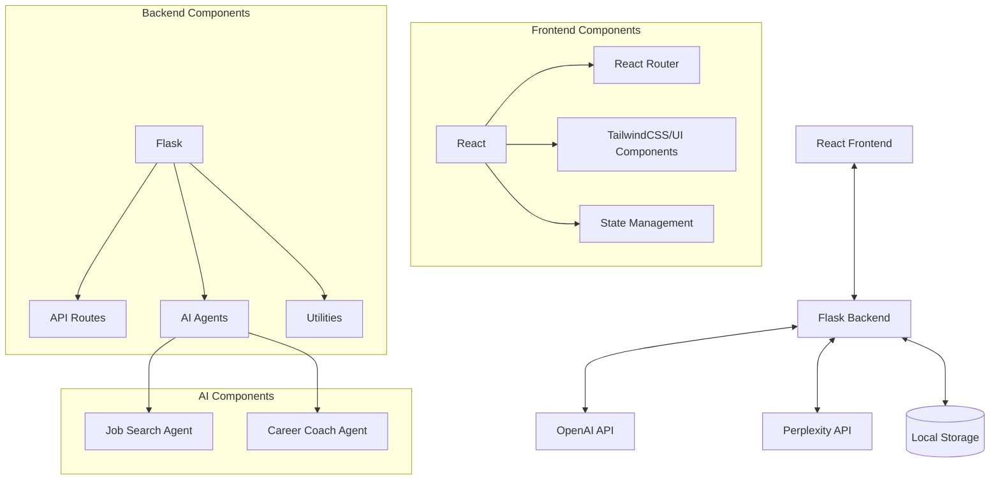

# Contributor Guide

This guide provides information for developers who want to contribute to the AI Career Coach & Job Search Agent project. It covers the project structure, development setup, coding standards, and contribution workflow.

## Project Structure

```
jobSearchAgent/
├── docs/                  # Documentation
├── frontend/              # React frontend
├── jobSearchAgent/        # Python package
│   ├── __init__.py
│   ├── agent.py           # Job Search Agent implementation
│   ├── career_coach_agent.py  # Career Coach Agent implementation
│   ├── cli.py             # Command-line interface
│   ├── api/               # API integrations
│   │   ├── __init__.py
│   │   └── perplexity.py  # Perplexity API wrapper
│   └── utils/             # Utility functions
│       ├── __init__.py
│       ├── document_parser.py  # CV parsing utilities
│       ├── pdf_extractor.py    # PDF text extraction
│       └── preferences.py      # User preferences management
├── main.py                # Entry point for command-line usage
├── requirements.txt       # Python dependencies
├── server.py              # Flask server for the backend API
└── start.sh               # Startup script
```

## Development Environment Setup

### Prerequisites

- Python 3.8+
- Node.js 14+
- npm or yarn
- Git

### Setting Up for Development

1. **Clone the repository**
   ```bash
   git clone <repository-url>
   cd jobSearchAgent
   ```

2. **Set up the Python environment**
   ```bash
   python -m venv venv
   source venv/bin/activate  # On Windows: venv\Scripts\activate
   pip install -r requirements.txt
   ```

3. **Set up environment variables**
   ```bash
   # Create a .env file with your API keys
   echo "OPENAI_API_KEY=your_openai_api_key" > .env
   echo "PERPLEXITY_API_KEY=your_perplexity_api_key" >> .env
   ```

4. **Set up the frontend**
   ```bash
   cd frontend
   npm install
   ```

5. **Run the development servers**
   ```bash
   # Terminal 1: Backend
   python server.py
   
   # Terminal 2: Frontend
   cd frontend
   npm start
   ```

## Architecture Overview



## Coding Standards

### Python Code

- Follow [PEP 8](https://www.python.org/dev/peps/pep-0008/) style guide
- Use docstrings for all modules, classes, and functions
- Include type hints where appropriate
- Write unit tests for new functionality

Example:
```python
def extract_text_from_file(file_bytes: bytes, file_name: str) -> Dict[str, Any]:
    """
    Extract text from various file formats.
    
    Args:
        file_bytes (bytes): The binary content of the file.
        file_name (str): The name of the file with extension.
        
    Returns:
        dict: The extracted text and metadata.
    """
    # Implementation here...
```

### JavaScript/React Code

- Use ES6+ syntax
- Follow the React functional component pattern with hooks
- Use descriptive variable and function names
- Use TailwindCSS for styling
- Implement proper error handling

Example:
```jsx
const JobSearchForm = ({ onSearch, initialValues = {} }) => {
  const [keywords, setKeywords] = useState(initialValues.keywords || '');
  const [location, setLocation] = useState(initialValues.location || '');
  
  const handleSubmit = (e) => {
    e.preventDefault();
    onSearch({ keywords, location });
  };
  
  return (
    <form onSubmit={handleSubmit} className="space-y-4">
      {/* Form fields */}
    </form>
  );
};
```

## Git Workflow

### Branching Strategy

- `main`: Production-ready code
- `dev`: Development branch for integration
- `feature/*`: Feature branches
- `bugfix/*`: Bug fix branches
- `docs/*`: Documentation updates

### Commit Messages

We use the [Gitmoji](https://gitmoji.dev/) convention for commit messages to make the purpose of commits more visible:

- ✨ `:sparkles:` - New feature
- 🐛 `:bug:` - Bug fix
- 📝 `:memo:` - Documentation update
- ♻️ `:recycle:` - Code refactoring
- 🎨 `:art:` - Improve structure/format of the code
- ⚡️ `:zap:` - Performance improvement

Example:
```
✨ Add CV analysis feature
```

### Pull Request Process

1. Create a new branch from `dev` for your work
2. Make your changes with appropriate commits
3. Push your branch to the repository
4. Create a pull request against the `dev` branch
5. Ensure your PR includes:
   - A clear description of the changes
   - Any relevant issue numbers
   - Notes on testing performed
6. Request review from at least one team member
7. Address any review comments
8. Once approved, your changes will be merged

## Testing

### Backend Testing

We use `pytest` for backend testing:

```bash
# Run all tests
pytest

# Run tests with coverage report
pytest --cov=jobSearchAgent
```

### Frontend Testing

We use Jest and React Testing Library for frontend testing:

```bash
# Navigate to frontend directory
cd frontend

# Run all tests
npm test

# Run tests with coverage
npm test -- --coverage
```

## Adding New Features

### Backend Extensions

To add new functionality to the backend:

1. Determine if your feature belongs in the Job Search Agent, Career Coach Agent, or utilities
2. Add new module(s) or extend existing ones
3. Update the Flask routes in `server.py` if adding new endpoints
4. Add tests for your new functionality
5. Update documentation

### Frontend Extensions

To add new features to the frontend:

1. Create or modify React components
2. Update routing if adding new pages
3. Add API client methods for new backend endpoints
4. Add tests for your components
5. Update documentation

## Dependencies

- **Backend dependencies** are managed in `requirements.txt`
- **Frontend dependencies** are managed in `frontend/package.json`

When adding new dependencies:
1. Ensure they are necessary and widely supported
2. Check for security vulnerabilities
3. Update the appropriate dependency file
4. Document the dependency in your PR

## Documentation

### Code Documentation

- All Python code should include docstrings
- Complex JavaScript functions should include JSDoc comments
- Include inline comments for non-obvious code sections

### Project Documentation

When updating features, please also update:
1. User guides if the user experience changes
2. API documentation if endpoints change
3. Architecture diagrams if the structure changes

## Deployment

### Local Deployment

```bash
# Run the start script
./start.sh
```

### Production Deployment

For production deployment:
1. Build the frontend:
   ```bash
   cd frontend
   npm run build
   ```

2. Serve the backend with a production WSGI server:
   ```bash
   gunicorn server:app
   ```

## Getting Help

If you have questions or issues:
1. Check existing documentation
2. Look for similar issues in the issue tracker
3. Create a new issue with a detailed description if needed
4. Reach out to the project maintainers

Thank you for contributing to the AI Career Coach & Job Search Agent project!
