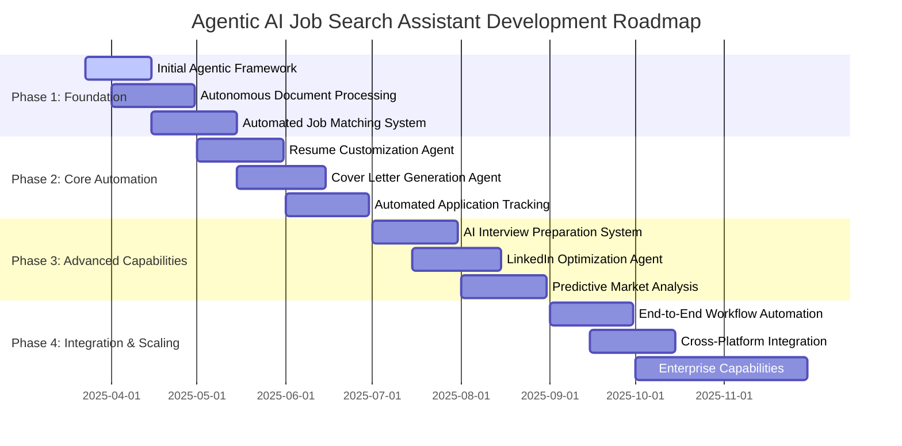

# Agentic AI Job Search Assistant Roadmap

This document outlines the development roadmap for transforming the AI Career Coach & Job Search Agent into a fully autonomous agentic system. The focus is on end-to-end automation of the job search process with minimal user intervention required.

## Vision

Create an AI agent that autonomously manages the entire job search lifecycle - from analyzing user career goals and preferences, identifying relevant job opportunities, customizing application materials, preparing users for interviews, tracking application status, to providing strategic market insights.

## Current Status

The application currently operates as an assisted tool with the following functionality:

- Basic job search using the Perplexity API
- CV analysis and career coaching using OpenAI GPT-4o
- User preference storage and management
- Career roadmap generation
- Local deployment with Flask backend and React frontend

## Development Timeline

## Agentic AI Feature Roadmap

### Phase 1: Foundation (Months 1-2)

#### Initial Agentic Framework
- [x] **Autonomous Agent Architecture**: Design and implement the core agent framework
- [x] **User Preference Learning System**: Develop capability to automatically learn and adapt to user preferences
- [x] **Continuous Processing Loop**: Create always-on background processing capabilities
- [x] **Agent Memory & Context Management**: Implement sophisticated memory system for maintaining context and history
- [ ] **Multi-agent Coordination**: Enable coordination between specialized sub-agents
- [x] **Testing Framework**: Develop comprehensive testing system for agent reliability

#### Autonomous Document Processing
- [x] **Advanced CV Parsing**: Implement robust document understanding with high accuracy
- [ ] **LinkedIn Profile Integration**: Automate importing and analysis of LinkedIn profiles
- [x] **Career Documents Library**: Develop system to maintain and understand user's career documents
- [x] **Continuous Document Assessment**: Create capability to automatically re-evaluate documents as requirements change
- [x] **Intelligent Error Handling**: Implement sophisticated handling of parsing errors and ambiguities
- [x] **Document-Based Insight Generation**: Automatically extract career insights from user documents

#### Automated Job Matching System
- [x] **Autonomous Job Discovery**: Implement continuous job searching across multiple sources
- [x] **Intelligent Job Filtering**: Develop sophisticated matching algorithms with implicit preference learning
- [x] **Real-time Job Alerts**: Create system for immediate notification of high-match opportunities
- [x] **Opportunity Prioritization**: Implement smart ranking of jobs based on multiple factors
- [x] **Auto-expanding Search Parameters**: Develop capability to intelligently broaden search when needed
- [x] **Search Volume Management**: Create mechanisms to control information flow to prevent user overload

### Phase 2: Core Automation (Months 3-4)

#### Resume Customization Agent
- [x] **Job Description Analysis**: Automate extraction of key requirements and preferences
- [x] **Keyword Optimization**: Implement intelligent keyword matching and integration
- [x] **Experience Re-framing**: Develop capability to reframe user experience to match job requirements
- [x] **Format Adjustment**: Create system to modify resume format based on industry/role standards
- [x] **Quality Validation**: Implement automated checks for professionalism and accuracy
- [x] **Version Management**: Develop system to track and manage multiple resume versions

#### Cover Letter Generation Agent
- [ ] **Personalized Cover Letter Creation**: Implement fully automated cover letter generation
- [ ] **Company Research Integration**: Develop capability to incorporate company-specific details
- [ ] **Tone and Style Adjustment**: Create system to match writing style to company culture
- [ ] **Accomplishment Highlighting**: Implement intelligent selection of relevant achievements
- [ ] **Custom Templates**: Develop industry and role-specific cover letter templates
- [ ] **Specialized Language Handling**: Enable handling of niche industry terminology

#### Automated Application Tracking
- [x] **Application Status Monitoring**: Implement system to track all submitted applications
- [x] **Status Change Detection**: Develop capability to automatically detect application status changes
- [x] **Follow-up Recommendation Engine**: Create intelligent system for follow-up timing and content
- [x] **Outcome Analysis**: Implement analytics to learn from application outcomes
- [x] **Visual Dashboard**: Develop comprehensive visualization of application status
- [x] **Data Export Capability**: Create functionality to export tracking data

### Phase 3: Advanced Capabilities (Months 5-6)

#### AI Interview Preparation System
- [x] **Custom Interview Simulation**: Implement personalized interview question generation
- [x] **Response Assessment**: Develop capability to evaluate and provide feedback on answers
- [x] **Company-specific Questions**: Create system to generate questions based on company research
- [x] **Technical Interview Preparation**: Implement support for technical role interview preparation
- [x] **Behavioral Question Analysis**: Develop framework for behavioral question preparation
- [x] **Progressive Difficulty Levels**: Create adaptive difficulty system based on user performance

#### LinkedIn Optimization Agent
- [ ] **Profile Analysis and Enhancement**: Implement automated LinkedIn profile assessment
- [ ] **Content Optimization**: Develop capability to suggest profile improvements
- [ ] **Keyword Enhancement**: Create system to increase profile visibility to recruiters
- [ ] **Connection Strategy**: Implement intelligent suggestions for network building
- [ ] **Content Schedule Management**: Develop posting schedule optimization
- [ ] **Engagement Analytics**: Create system to track and improve profile engagement

#### Predictive Market Analysis
- [x] **Industry Trend Analysis**: Implement market trend identification and analysis
- [x] **Skill Demand Forecasting**: Develop prediction system for future skill requirements
- [x] **Salary Data Integration**: Create comprehensive salary insights by role and location
- [x] **Opportunity Growth Mapping**: Implement visualization of growing opportunity areas
- [x] **Career Path Prediction**: Develop system for career trajectory forecasting
- [x] **Strategic Recommendation Engine**: Create personalized strategy recommendations based on market conditions

### Phase 4: Integration & Scaling (Months 7-9)

#### End-to-End Workflow Automation
- [x] **Unified Agent Workflow**: Implement seamless coordination between all agent components
- [x] **Automation Threshold Control**: Develop system for user to control automation levels
- [x] **Process Monitoring Dashboard**: Create visual representation of agent activities
- [x] **Error Recovery Systems**: Implement sophisticated error handling across the entire process
- [x] **Optimization Feedback Loop**: Develop continuous improvement based on outcomes
- [x] **Agent Performance Metrics**: Create comprehensive agent effectiveness measurements

#### Cross-Platform Integration
- [ ] **Job Board API Integration**: Implement direct connections to multiple job platforms
- [ ] **ATS System Integration**: Develop capability to work with applicant tracking systems
- [ ] **Email Integration**: Create email monitoring and response capabilities
- [ ] **Calendar Management**: Implement interview scheduling and reminders
- [ ] **Mobile Companion App**: Develop mobile interface for on-the-go management
- [x] **Notification System**: Create multi-channel alert system

#### Enterprise Capabilities
- [ ] **Multi-user Management**: Implement support for team and organizational use
- [ ] **Role-based Access Control**: Develop sophisticated permission system
- [ ] **Enterprise Analytics**: Create organizational insights and reporting
- [ ] **Compliance Framework**: Implement privacy and regulatory compliance
- [ ] **White-label Capability**: Develop customization for enterprise branding
- [ ] **Data Security Enhancements**: Implement enterprise-grade security

## User Stories and Acceptance Criteria

### 1. Career Goal Processing Automation

**As an AI agent, I automatically process and analyze detailed user-input career goals, skills, job preferences, and key supporting documents to provide instant, personalized career advice and targeted job matches.**

**Acceptance Criteria:**
- Autonomously parse and understand user preferences from various input sources
- Provide real-time adaptive recommendations based on continuous input analysis
- Handle ambiguous or incomplete user inputs through intelligent prompts
- Maintain a learning system that improves understanding of user goals over time

### 2. Automated Resume Customization

**As an AI agent, I autonomously generate tailored resumes optimized for specific job postings by analyzing job descriptions and aligning user experiences and keywords to enhance job application outcomes.**

**Acceptance Criteria:**
- Extract and integrate relevant keywords from job descriptions to resume
- Dynamically adjust resume content and formatting based on job requirements
- Perform automatic quality validation checks for accuracy and professionalism
- Provide automated feedback for resume improvements
- Require minimal human intervention in the customization process

### 3. Intelligent Cover Letter Automation

**As an AI agent, I autonomously draft personalized, impactful cover letters customized to individual job applications by analyzing both user profiles and job postings to maximize interview invitations.**

**Acceptance Criteria:**
- Generate tailored cover letters using AI-driven natural language processing
- Adapt content in real-time based on specific job criteria
- Handle specialized job roles requiring niche terminology
- Require minimal manual adjustments by the user
- Maintain appropriate tone and style matching company culture

### 4. LinkedIn Profile Optimization Automation

**As an AI agent, I proactively analyze, enhance, and manage the user's LinkedIn profile to boost visibility, engagement, and recruiter attraction by continuously optimizing profile content and structure.**

**Acceptance Criteria:**
- Continuously assess and update profile components
- Engage with LinkedIn analytics to refine optimization strategies
- Autonomously implement profile enhancements
- Conduct scheduled profile reviews with adaptive frequency
- Provide clear metrics on profile performance improvements

### 5. Automated Job Posting Discovery

**As an AI agent, I autonomously identify, filter, and present highly relevant job opportunities based on ongoing user analysis, preferences, and skill alignment, significantly reducing manual search efforts.**

**Acceptance Criteria:**
- Automatically identify and prioritize relevant job postings
- Provide real-time alerts for immediate application opportunities
- Integrate seamlessly with user workflow for managing job postings
- Effectively manage job posting volume to prevent user overload
- Continuously refine search criteria based on user feedback and interactions

### 6. AI-Driven Interview Preparation Automation

**As an AI agent, I autonomously generate realistic interview simulations, including custom questions and ideal response frameworks, based on user profiles and target job roles to enhance interview readiness.**

**Acceptance Criteria:**
- Create customized interview preparation materials automatically
- Provide real-time, personalized feedback on interview responses
- Adjust interview coaching based on user performance
- Generate company-specific and role-specific questions
- Support different interview formats (behavioral, technical, case studies)

### 7. Automated Skill Gap Analysis

**As an AI agent, I continuously analyze targeted job descriptions against user profiles to automatically identify skill gaps and autonomously suggest personalized skill development paths and resources.**

**Acceptance Criteria:**
- Detect skill gaps with clear analytics and visualizations
- Provide real-time personalized recommendations for skill development
- Track and update user skill development progress
- Identify high-impact skills that would most improve job prospects
- Suggest specific learning resources for addressing skill gaps

### 8. Application Tracking & Analytics

**As an AI agent, I automatically track and visualize application status, response times, and success rates to inform and optimize job-hunting strategies.**

**Acceptance Criteria:**
- Track and update application statuses in real-time
- Generate automated analytics and visualization of application success metrics
- Provide a user-friendly dashboard for easy interpretation of data
- Send notifications for important updates or required actions
- Allow data export for external analysis or record-keeping

### 9. Predictive Job Market Insights

**As an AI agent, I deliver AI-driven forecasts and strategic recommendations based on job market trends to help users proactively adjust their job search strategies.**

**Acceptance Criteria:**
- Regularly analyze market trends, skill demand, and emerging industries
- Provide personalized strategic recommendations tailored to user's career goals
- Send timely notifications about significant market changes or opportunities
- Present interactive and easy-to-understand data visualizations
- Allow users to explore detailed trend data and forecasts

## Technical Implementation Priorities

### AI & Machine Learning
- **Large Language Model Integration**: Implement advanced LLMs for natural language understanding and generation
- **Autonomous Agent Framework**: Develop a robust framework for agent autonomy and decision making
- **Multi-model Ensemble Approach**: Combine specialized AI models for different tasks
- **Continuous Learning System**: Implement capability for system to improve based on outcomes
- **Document Understanding AI**: Develop specialized models for parsing career documents

### Backend Infrastructure
- **Scalable Cloud Architecture**: Design for high availability and performance
- **Asynchronous Processing**: Implement background job processing for agent tasks
- **Secure Data Storage**: Develop encrypted storage for sensitive user information
- **API Gateway**: Create unified access point for multiple external services
- **Database Optimization**: Implement efficient database design for agent memory

### Frontend Experience
- **Agent Activity Visualization**: Develop interface showing agent actions and status
- **Automation Control Center**: Create dashboard for setting agent parameters
- **Progress Tracking UI**: Implement visual representation of job search progress
- **Mobile Responsive Design**: Ensure full functionality across devices
- **Accessibility Compliance**: Implement WCAG 2.1 AA compliance

### Security & Privacy
- **End-to-end Encryption**: Implement encryption for sensitive data
- **Role-based Access Control**: Develop sophisticated permission system
- **Audit Logging**: Create comprehensive logging of agent actions
- **Data Retention Policies**: Implement configurable data retention
- **Compliance Framework**: Ensure adherence to relevant regulations

## Success Metrics

### User Impact
- **Time Saved**: Measure reduction in manual job search time
- **Application Quality**: Track improvement in application response rates
- **Interview Success Rate**: Measure increase in interview invitations
- **Job Offer Rate**: Track improvement in job offer success
- **User Satisfaction**: Measure satisfaction with agent automation

### Technical Performance
- **Automation Rate**: Percentage of tasks completed without human intervention
- **Accuracy Metrics**: Measure precision of agent recommendations and actions
- **Processing Speed**: Time to complete various agent tasks
- **Stability Metrics**: Track system uptime and error rates
- **Scalability Performance**: System performance under increasing user load

## Get Involved

We welcome contributions in the following areas:
- Agent framework development
- AI model integration and optimization
- External API integrations
- User experience design for agent interfaces
- Testing and quality assurance

To contribute to the agentic AI roadmap:
1. Review existing GitHub issues
2. Create a new issue with the "agent-enhancement" label
3. Provide details on your proposed feature or improvement
4. Discuss with the project team
5. Submit pull requests for approved enhancements

## Feedback and Suggestions

We value your input on our agentic AI development roadmap. To provide feedback:
- Create an issue in the GitHub repository
- Join our discussion forum on agent capabilities
- Reach out to the project maintainers directly

This roadmap is a living document and will be updated as the project evolves.
