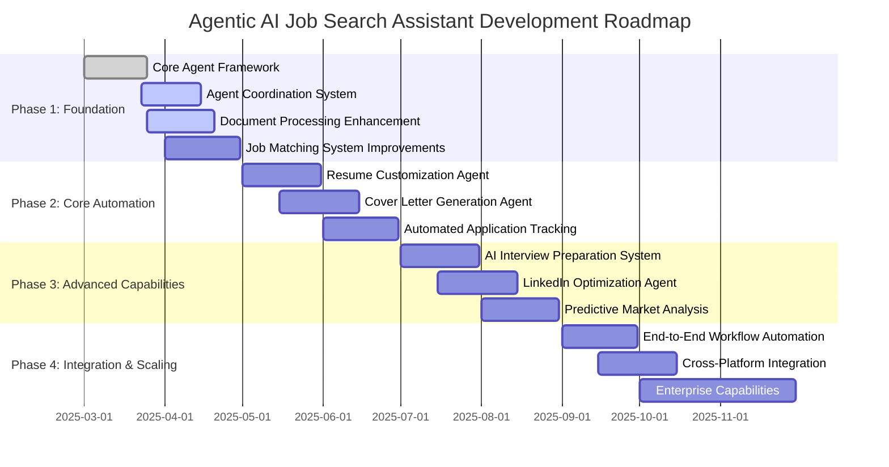

# Agentic AI Job Search Assistant Roadmap (Updated)

This document outlines the updated development roadmap for transforming the AI Career Coach & Job Search Agent into a fully autonomous agentic system. The focus is on end-to-end automation of the job search process with minimal user intervention required.

## Vision

Create an AI agent that autonomously manages the entire job search lifecycle - from analyzing user career goals and preferences, identifying relevant job opportunities, customizing application materials, preparing users for interviews, tracking application status, to providing strategic market insights.

## Current Status (March 2025)

The application has made significant progress with the following functionality:

- **Core Agent Framework**: Basic implementation of the agent system with message bus and monitoring
- **CV Analysis**: Robust document understanding with high accuracy
- **Career Coaching**: Personalized career guidance using OpenAI GPT-4o
- **Job Search Integration**: Basic and preference-enhanced job searching via Perplexity API
- **User Preference System**: Storage and utilization of user career preferences
- **Local Deployment**: Working Flask backend and React frontend setup

## Implementation Focus for Next 30 Days

1. **Complete Agent Coordination System**:
   - Finalize the message bus architecture
   - Implement agent registry system
   - Enable basic coordination patterns between specialized agents
   - Add complete monitoring and logging functionality

2. **Enhance Document Processing**:
   - Improve CV parsing accuracy for edge cases
   - Add support for more document formats
   - Implement document versioning
   - Add batch processing capabilities

3. **Improve Job Matching System**:
   - Enhance job filtering algorithms
   - Implement semantic matching for skills
   - Add real-time alerts for high-match opportunities
   - Create visualization of match scoring

4. **Stabilize User Interface**:
   - Implement core UI components for agent interactions
   - Create dashboard for agent activity monitoring
   - Add preference management interface
   - Improve overall UX for common workflows

## Development Timeline (Revised)

## Agentic AI Feature Roadmap

### Phase 1: Foundation (Apr 2025 Completion)

#### Agent Coordination System
- [x] **Base Agent Architecture**: Core agent class with messaging capabilities
- [x] **Message Bus Implementation**: Communication system between agents
- [x] **Agent Monitoring**: Basic metrics and logging for agent activities
- [ ] **Agent Registry**: Central registry for agent discovery and management
- [ ] **Coordination Patterns**: Implementation of common interaction patterns
- [ ] **State Synchronization**: Maintain consistent state across agents

#### Document Processing Enhancement
- [x] **Advanced CV Parsing**: Robust document understanding with high accuracy
- [x] **Multi-format Support**: Handle various document formats (PDF, DOCX, TXT)
- [x] **Skill Extraction**: Identify and categorize skills from documents
- [ ] **Document Versioning**: Track document versions and changes
- [ ] **Batch Processing**: Handle multiple documents efficiently
- [ ] **Document Quality Assessment**: Evaluate and score document quality

#### Job Matching System Improvements
- [x] **Basic Job Search**: Simple keyword-based job searching
- [x] **Preference Integration**: Incorporate user preferences into search
- [ ] **Semantic Matching**: Match jobs based on semantic understanding of skills
- [ ] **Match Visualization**: Visual representation of match quality
- [ ] **Real-time Alerts**: Immediate notification of high-quality matches
- [ ] **Search Parameter Optimization**: Auto-tune search parameters based on results

#### User Interface Stabilization
- [x] **Basic UI Components**: Essential interface components
- [ ] **Agent Control Interface**: Control panel for agent settings
- [ ] **Activity Dashboard**: Visual representation of agent activities
- [ ] **Preference Management**: Interface for managing user preferences
- [ ] **Document Management**: Interface for document upload and management
- [ ] **Job Results Visualization**: Improved presentation of job search results

### Phase 2: Core Automation (Jun 2025 Completion)

#### Resume Customization Agent
- [ ] **Job Description Analysis**: Extract requirements from job postings
- [ ] **Keyword Optimization**: Integrate relevant keywords into resumes
- [ ] **Content Adaptation**: Adjust resume content for specific jobs
- [ ] **Format Customization**: Modify resume format for different industries
- [ ] **Quality Validation**: Verify resume quality and professionalism
- [ ] **Version Management**: Track and manage multiple resume versions

#### Cover Letter Generation Agent
- [ ] **Personalized Content**: Generate tailored cover letters
- [ ] **Company Research**: Incorporate company-specific information
- [ ] **Style Adaptation**: Match writing style to company culture
- [ ] **Accomplishment Highlighting**: Emphasize relevant achievements
- [ ] **Template Library**: Industry and role-specific templates
- [ ] **Quality Assurance**: Ensure professional tone and content

#### Automated Application Tracking
- [ ] **Status Monitoring**: Track application status across jobs
- [ ] **Email Integration**: Monitor emails for application-related information
- [ ] **Status Change Detection**: Identify and update application status
- [ ] **Follow-up Management**: Suggest and generate follow-up communications
- [ ] **Analytics Dashboard**: Visualize application metrics and success rates
- [ ] **Outcome Analysis**: Learn from application results to improve future applications

### Phase 3: Advanced Capabilities (Aug 2025 Completion)

#### AI Interview Preparation System
- [ ] **Custom Question Generation**: Create job-specific interview questions
- [ ] **Mock Interview Simulator**: Interactive interview practice
- [ ] **Response Evaluation**: Analyze and provide feedback on answers
- [ ] **Company-specific Preparation**: Customize for specific companies
- [ ] **Behavioral Question Framework**: STAR method coaching
- [ ] **Technical Interview Support**: Domain-specific technical preparation

#### LinkedIn Optimization Agent
- [ ] **Profile Analysis**: Evaluate LinkedIn profile effectiveness
- [ ] **Content Enhancement**: Suggest profile improvements
- [ ] **Keyword Optimization**: Increase profile visibility to recruiters
- [ ] **Network Strategy**: Strategic connection recommendations
- [ ] **Engagement Analytics**: Track profile performance
- [ ] **Content Schedule**: Plan profile activity for maximum impact

#### Predictive Market Analysis
- [ ] **Skill Demand Tracking**: Monitor changing skill requirements
- [ ] **Industry Trend Analysis**: Identify growth areas and opportunities
- [ ] **Salary Data Integration**: Provide compensation insights
- [ ] **Career Path Mapping**: Visualize career progression options
- [ ] **Strategic Recommendations**: Personalized career strategy suggestions
- [ ] **Market Alert System**: Notifications about relevant market changes

### Phase 4: Integration & Scaling (Nov 2025 Completion)

#### End-to-End Workflow Automation
- [ ] **Unified Agent Orchestration**: Seamless coordination across all components
- [ ] **Automation Controls**: User-configurable automation levels
- [ ] **Process Monitoring**: Visual workflow tracking
- [ ] **Error Recovery**: Automatic handling of process failures
- [ ] **Optimization Feedback Loop**: Continuous performance improvement
- [ ] **Performance Metrics**: Comprehensive system effectiveness tracking

#### Cross-Platform Integration
- [ ] **Job Board API Connections**: Direct integration with major job platforms
- [ ] **ATS Integration**: Compatibility with applicant tracking systems
- [ ] **Email Service Integration**: Advanced email monitoring and management
- [ ] **Calendar Integration**: Interview and follow-up scheduling
- [ ] **Mobile Applications**: On-the-go access to agent functionality
- [ ] **Notification System**: Multi-channel alerts and updates

#### Enterprise Capabilities
- [ ] **Multi-user Support**: Team and organizational usage
- [ ] **Role-based Access**: Sophisticated permission system
- [ ] **Enterprise Analytics**: Organization-level insights
- [ ] **Compliance Framework**: Regulatory and policy adherence
- [ ] **White-label Options**: Branding customization
- [ ] **Security Enhancements**: Enterprise-grade data protection

## Technical Implementation Priorities

### Agent System Improvements
1. **Message Bus Optimization**
   - Implement reliable message delivery with retry mechanisms
   - Add message filtering capabilities
   - Improve performance for high message volumes

2. **Agent Memory Enhancement**
   - Develop persistent memory for agent state
   - Implement context management across sessions
   - Create memory indexing for efficient retrieval

3. **Monitoring System Completion**
   - Finalize metric collection architecture
   - Add visualization for agent performance
   - Implement alerting for critical issues

### AI Integration
1. **LLM Integration Enhancement**
   - Improve prompt engineering for consistent results
   - Implement fallback mechanisms for API failures
   - Add caching for common LLM operations

2. **AI Model Evaluation**
   - Create testing framework for model accuracy
   - Benchmark different models for specific tasks
   - Establish quality metrics for AI-generated content

### Security & Privacy
1. **Data Protection**
   - Implement end-to-end encryption for sensitive data
   - Create secure document storage
   - Develop privacy controls for user data

2. **Authentication & Authorization**
   - Enhance user authentication system
   - Implement fine-grained permission controls
   - Add audit logging for security events

## User Stories and Acceptance Criteria

### 1. Core Agent Interaction

**As a user, I want to interact with AI agents through an intuitive interface that provides transparency into agent activities and allows me to control automation levels.**

**Acceptance Criteria:**
- View current status and activities of all agents
- Set automation level for each agent (manual, semi-automated, fully automated)
- Receive notifications about important agent actions
- Override or modify agent decisions when needed
- Understand the reasoning behind agent suggestions

### 2. Document Management

**As a user, I want to manage my career documents in a centralized system that analyzes them, tracks versions, and optimizes them for job applications.**

**Acceptance Criteria:**
- Upload multiple document formats (PDF, DOCX, TXT)
- Receive detailed analysis of document content and quality
- Track document versions and changes over time
- Compare document metrics against industry standards
- Generate improved versions based on specific job requirements

### 3. Intelligent Job Search

**As a user, I want the system to continuously search for relevant job opportunities across multiple sources, filtering and ranking them based on my preferences and profile.**

**Acceptance Criteria:**
- View jobs ranked by match percentage with my profile
- Understand why specific jobs were recommended
- Filter jobs by various criteria (location, salary, company, etc.)
- Receive alerts for high-match opportunities
- Save interesting positions for later consideration
- Track application deadlines

### 4. Interview Preparation

**As a user, I want personalized interview preparation that includes custom questions, mock interviews, and detailed feedback to improve my performance.**

**Acceptance Criteria:**
- Practice with job-specific interview questions
- Receive constructive feedback on responses
- Track improvement over multiple practice sessions
- Access company-specific preparation materials
- Prepare for different interview formats (behavioral, technical, case studies)
- Review last-minute preparation guides before interviews

## Success Metrics

### 1. User Engagement
- **Active Usage Rate**: Percentage of registered users actively using the system weekly
- **Feature Adoption**: Percentage of available features being utilized
- **Session Duration**: Average time spent using the application
- **Retention Rate**: Percentage of users returning after 30 days

### 2. Agent Effectiveness
- **Automation Rate**: Percentage of tasks completed without human intervention
- **Decision Accuracy**: Percentage of agent decisions accepted by users
- **Processing Speed**: Average time to complete various agent tasks
- **Error Rate**: Frequency of agent errors requiring human correction

### 3. Job Search Outcomes
- **Match Quality**: Accuracy of job-user matching
- **Application Rate**: Number of applications submitted
- **Interview Success**: Percentage of applications resulting in interviews
- **Time Efficiency**: Reduction in time spent on job search activities

## Implementation Guidelines

### 1. Agent Development
- Build agents as modular, independent components
- Use a common message format for all agent communication
- Implement comprehensive logging for debugging
- Create unit tests for core agent functionality
- Document agent interfaces and behaviors

### 2. UI Development
- Prioritize usability and clear information presentation
- Provide transparency into agent operations
- Use consistent design patterns across the application
- Implement responsive design for mobile compatibility
- Follow accessibility best practices

### 3. AI Integration
- Implement error handling for all AI service calls
- Monitor and optimize token usage
- Create fallback mechanisms for service disruptions
- Continuously evaluate model performance
- Document prompt engineering approaches

## Looking Ahead

The Agentic AI Job Search Assistant aims to revolutionize the job search process by combining advanced AI capabilities with a user-centric approach. By focusing on the immediate foundation phase while maintaining a clear vision for advanced capabilities, we're building a system that will save users time, reduce stress, and improve outcomes in their career journey.

Future expansions may include:
- Integration with educational platforms for skill development
- Career coaching with human expert augmentation
- Salary negotiation assistance
- Onboarding preparation support
- Career transition specialized guidance

This roadmap is a living document that will be updated as development progresses and in response to user feedback and market conditions.
