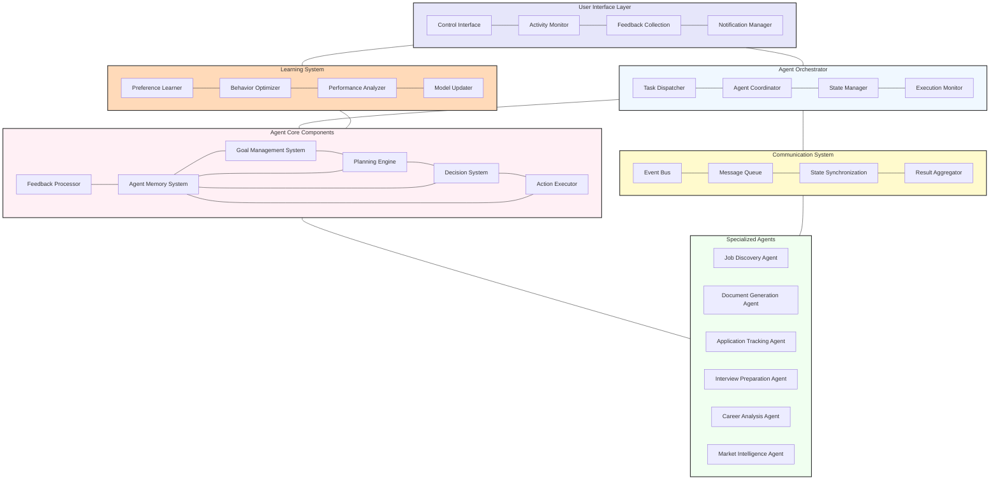

# Agent Framework Architecture

This diagram illustrates the core components of the agent framework that powers the autonomous capabilities of the AI Job Search Assistant.

## Agent Framework Details

The agent framework is the foundation of the system's autonomous capabilities, enabling intelligent, coordinated action across multiple specialized components. This architecture enables the system to function as a cohesive, goal-directed agent rather than a collection of disconnected features.

### Agent Orchestrator
The central coordination component that manages the overall agent operation:

- **Task Dispatcher**: Distributes tasks to appropriate specialized agents
- **Agent Coordinator**: Manages interactions between multiple agents working toward shared goals
- **State Manager**: Maintains the current state of all agent operations
- **Execution Monitor**: Tracks progress of agent tasks and handles exceptions

### Agent Core Components
The fundamental building blocks of agent capabilities:

- **Goal Management System**: Defines, tracks, and prioritizes user and system goals
  - Short-term goals (e.g., customize a resume for a specific job)
  - Medium-term goals (e.g., secure interviews in a specific industry)
  - Long-term goals (e.g., career advancement in a chosen path)

- **Planning Engine**: Creates plans to achieve identified goals
  - Plan generation based on current state and goals
  - Plan refinement through simulation
  - Plan adjustment based on new information
  - Contingency planning for potential failures

- **Decision System**: Makes choices among available options
  - Option evaluation against multiple criteria
  - Risk assessment
  - Confidence scoring
  - Decision explanation generation

- **Action Executor**: Carries out planned actions
  - Action sequencing
  - Precondition verification
  - Post-action verification
  - Retry mechanisms

- **Agent Memory System**: Maintains information across interactions
  - Episodic memory (interaction history)
  - Semantic memory (knowledge and facts)
  - Working memory (current context)
  - Procedural memory (learned behaviors)

- **Feedback Processor**: Integrates user and system feedback
  - Explicit feedback capture
  - Implicit feedback inference
  - Feedback categorization
  - Memory updating

### Specialized Agents
Domain-specific agent modules with specialized knowledge and capabilities:

- **Job Discovery Agent**: Autonomous job search and matching
- **Document Generation Agent**: Resume and cover letter customization
- **Application Tracking Agent**: Application status monitoring and follow-up
- **Interview Preparation Agent**: Custom interview simulation and feedback
- **Career Analysis Agent**: Skills assessment and development planning
- **Market Intelligence Agent**: Job market trend analysis

Each specialized agent includes:
- Domain-specific knowledge base
- Specialized planning capabilities
- Custom evaluation criteria
- Domain-specific actions

### Communication System
Components enabling coordination between different system elements:

- **Event Bus**: Publishes and subscribes to system events
- **Message Queue**: Manages asynchronous communication between components
- **State Synchronization**: Ensures consistent state across distributed components
- **Result Aggregator**: Combines outputs from multiple agents into cohesive results

### User Interface Layer
Components for user-agent interaction:

- **Control Interface**: User controls for automation levels and agent behavior
- **Activity Monitor**: Visualization of agent activities and status
- **Feedback Collection**: User feedback capture mechanisms
- **Notification Manager**: User alerting for important events and required inputs

### Learning System
Components for improving agent performance over time:

- **Preference Learner**: Discovers user preferences through direct and indirect signals
- **Behavior Optimizer**: Refines agent behaviors based on outcomes and feedback
- **Performance Analyzer**: Evaluates effectiveness of agent actions and decisions
- **Model Updater**: Updates underlying AI models based on new learning

## Key Framework Principles

### Autonomy Management
The framework supports variable levels of autonomy, allowing users to:
- Specify global automation preferences
- Set domain-specific automation levels
- Establish boundaries for autonomous action
- Override agent decisions when desired

### Transparency
All agent operations maintain transparency through:
- Detailed activity logging
- Decision factor recording
- Confidence level reporting
- Explainable AI techniques

### Continuous Learning
The system improves through multiple learning mechanisms:
- Supervised learning from explicit feedback
- Reinforcement learning from outcomes
- Transfer learning across domains
- Preference learning from user interactions

### Coordination
Specialized agents work in concert through:
- Shared goal hierarchies
- Consistent memory access
- Standardized communication protocols
- Conflict resolution mechanisms

This agent framework architecture enables the system to function as a truly autonomous assistant that can handle the complexities of the job search process while maintaining user trust through transparency and control.
