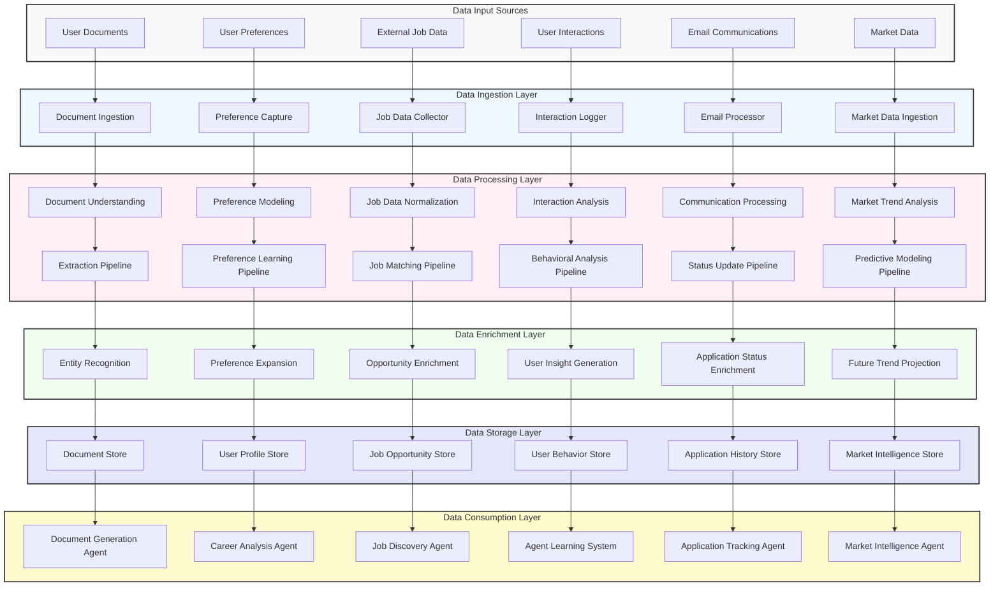

# Data Processing Pipeline

This diagram illustrates the data processing pipelines that handle information flow through the Agentic AI Job Search Assistant.

## Data Processing Pipeline Details

The data processing pipelines form the backbone of the system's intelligence, transforming raw data into actionable insights and enabling autonomous agent operations. These pipelines handle diverse data types from multiple sources, applying sophisticated processing to extract maximum value.

### Data Input Sources
The entry points for data into the system:

- **User Documents**: Resumes, cover letters, portfolios, and other user-provided documents
- **User Preferences**: Explicit and implicit preference information
- **External Job Data**: Job listings, company information, and requirements
- **User Interactions**: User actions, decisions, and feedback within the system
- **Email Communications**: Email correspondence related to job applications and interviews
- **Market Data**: Industry trends, salary information, and skill demand data

### Data Ingestion Layer
The first stage of data processing, handling initial data capture:

- **Document Ingestion**: Captures and validates user-provided documents
  - Format validation
  - Content verification
  - Metadata extraction
  - Version control

- **Preference Capture**: Records user preferences from various sources
  - Direct preference settings
  - Questionnaire responses
  - Onboarding choices
  - Settings adjustments

- **Job Data Collector**: Gathers job information from multiple sources
  - Job board API integration
  - Website scraping (where permitted)
  - Direct employer feeds
  - Recruiter submissions

- **Interaction Logger**: Records user interactions with the system
  - UI interactions
  - Decision points
  - Time spent on activities
  - Navigation patterns

- **Email Processor**: Handles email communications
  - Authorized email account monitoring
  - Application confirmation detection
  - Interview invitation identification
  - Rejection notification processing

- **Market Data Ingestion**: Collects job market information
  - Industry trend reports
  - Salary surveys
  - Skill demand indicators
  - Geographic opportunity mapping

### Data Processing Layer
The transformation stage that converts raw data into structured information:

- **Document Understanding**: Extracts meaningful information from documents
  - Text extraction and classification
  - Section identification
  - Entity recognition
  - Relationship mapping

- **Preference Modeling**: Transforms preference inputs into structured models
  - Preference formalization
  - Preference hierarchy construction
  - Preference consistency verification
  - Cross-domain preference integration

- **Job Data Normalization**: Standardizes job information from diverse sources
  - Field mapping and normalization
  - Terminology standardization
  - Duplicate detection
  - Quality scoring

- **Interaction Analysis**: Processes user interaction data
  - Session analysis
  - Task completion tracking
  - Engagement measurement
  - Pattern identification

- **Communication Processing**: Analyzes communications content
  - Message classification
  - Status change detection
  - Sentiment analysis
  - Response requirement identification

- **Market Trend Analysis**: Processes market data
  - Trend identification
  - Pattern recognition
  - Anomaly detection
  - Correlation analysis

### Specialized Processing Pipelines
Advanced processing streams for specific data types:

- **Extraction Pipeline**: Derives structured information from unstructured documents
- **Preference Learning Pipeline**: Builds and refines user preference models
- **Job Matching Pipeline**: Evaluates alignment between user profiles and job opportunities
- **Behavioral Analysis Pipeline**: Uncovers patterns in user behavior
- **Status Update Pipeline**: Tracks changes in application statuses
- **Predictive Modeling Pipeline**: Generates forecasts based on historical and current data

### Data Enrichment Layer
Enhances processed data with additional context and meaning:

- **Entity Recognition**: Identifies and categorizes named entities
  - Skills identification
  - Company recognition
  - Role categorization
  - Industry classification

- **Preference Expansion**: Extends explicit preferences with inferred preferences
  - Preference inference
  - Preference generalization
  - Cross-domain transfer
  - Preference strength modeling

- **Opportunity Enrichment**: Enhances job listings with additional context
  - Company information augmentation
  - Industry context addition
  - Geographic insights
  - Compensation normalization

- **User Insight Generation**: Creates deeper understanding from behavioral data
  - Interest inference
  - Motivation modeling
  - Decision pattern recognition
  - Engagement driver identification

- **Application Status Enrichment**: Adds context to application status changes
  - Timeline normalization
  - Benchmark comparison
  - Progress categorization
  - Outcome prediction

- **Future Trend Projection**: Extends current trends into forward-looking insights
  - Trend extrapolation
  - Seasonality adjustment
  - Scenario generation
  - Confidence scoring

### Data Storage Layer
Persistent storage for processed and enriched data:

- **Document Store**: Repository for user documents and extracted information
- **User Profile Store**: Comprehensive storage of user career information and preferences
- **Job Opportunity Store**: Database of job listings and associated metadata
- **User Behavior Store**: Record of user interactions and behavioral patterns
- **Application History Store**: Comprehensive application status and history
- **Market Intelligence Store**: Repository for job market trends and analysis

### Data Consumption Layer
Components that utilize processed data for system operations:

- **Document Generation Agent**: Creates customized application documents
- **Career Analysis Agent**: Provides career insights and recommendations
- **Job Discovery Agent**: Identifies and evaluates job opportunities
- **Agent Learning System**: Improves agent behavior through data-driven learning
- **Application Tracking Agent**: Monitors and manages application processes
- **Market Intelligence Agent**: Delivers market insights and predictions

## Key Pipeline Characteristics

### Scalability
The pipeline architecture is designed for horizontal scaling:
- Component-based design allows independent scaling
- Stateless processing enables easy distribution
- Queue-based communication handles load spikes
- Caching layers improve performance under load

### Real-time Processing
Critical data flows support real-time processing:
- Streaming architecture for time-sensitive data
- Prioritization mechanisms for urgent processing
- Progressive processing for large data volumes
- Event-driven triggers for immediate analysis

### Data Quality
Multiple mechanisms ensure high data quality:
- Input validation at ingestion
- Normalization during processing
- Anomaly detection for unusual data
- Consistency checks across data sources
- Source credibility scoring

### Privacy and Security
Data protection is built into the pipeline design:
- Sensitive data encryption
- Access control at each processing stage
- Anonymization where appropriate
- Retention policies for data lifecycle management
- Audit trails for all data access

This data processing pipeline enables the system to transform diverse raw data into the structured, contextualized information required for intelligent autonomous operation, while maintaining scalability, performance, and security.
