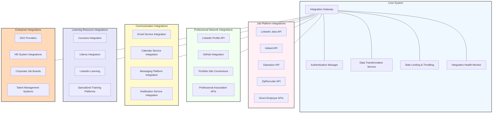

# Integration Architecture

This diagram illustrates the integration architecture of the Agentic AI Job Search Assistant, showing how it connects with external systems and services.

## Integration Architecture Details

The integration architecture enables the Agentic AI Job Search Assistant to connect with a wide range of external services and platforms, extending its capabilities beyond its core functionality. This architecture is designed for flexibility, security, and resilience, ensuring reliable connections while maintaining data privacy and protection.

### Core Integration System
The central components managing all external connections:

- **Integration Gateway**: Central entry and exit point for all external integrations
  - Unified API facade
  - Connection pooling
  - Request routing
  - Response caching
  - Circuit breaker implementation

- **Authentication Manager**: Handles security for all external connections
  - OAuth 2.0 integration
  - API key management
  - Token refresh handling
  - Credential encryption
  - Multi-tenant authentication

- **Data Transformation Service**: Converts between external and internal data formats
  - Schema mapping
  - Format conversion
  - Data validation
  - Transformation caching
  - Custom transformation rules

- **Rate Limiting & Throttling**: Manages API usage within allowable limits
  - API quota management
  - Request prioritization
  - Backoff strategies
  - Usage analytics
  - Adaptive throttling

- **Integration Health Monitor**: Tracks status of all integrations
  - Real-time availability monitoring
  - Performance tracking
  - Error rate monitoring
  - Alerting system
  - Integration status dashboard

### Job Platform Integrations
Connections to job listing services and boards:

- **LinkedIn Jobs API**: Access to LinkedIn's job postings
  - Job search capabilities
  - Application submission (where supported)
  - Company information retrieval
  - Job recommendation access

- **Indeed API**: Integration with Indeed's job platform
  - Comprehensive job search
  - Employer reviews
  - Salary data
  - Application tracking

- **Glassdoor API**: Connection to Glassdoor's services
  - Job listings access
  - Company reviews and ratings
  - Salary information
  - Interview questions and reviews

- **ZipRecruiter API**: Integration with ZipRecruiter platform
  - Job posting search
  - Application submission
  - Candidate matching

- **Direct Employer APIs**: Connections to specific employer career sites
  - Custom integrations for major employers
  - ATS system connections
  - Application status tracking
  - Recruiter communication

### Professional Network Integrations
Connections to professional and career-focused platforms:

- **LinkedIn Profile API**: Integration with LinkedIn profiles
  - Profile import and synchronization
  - Network analysis
  - Endorsement management
  - Activity tracking

- **GitHub Integration**: Connection to GitHub for technical profiles
  - Repository access
  - Contribution analysis
  - Skills demonstration
  - Project showcase

- **Portfolio Site Connections**: Integration with professional portfolio platforms
  - Portfolio content analysis
  - Work sample cataloging
  - Skill demonstration evidence
  - Accomplishment verification

- **Professional Association APIs**: Connections to industry organizations
  - Membership verification
  - Certification validation
  - Industry event access
  - Community connections

### Communication Integrations
Connections to communication and scheduling platforms:

- **Email Service Integration**: Connection to email providers
  - Email monitoring (with permission)
  - Automated email sending
  - Email template management
  - Conversation threading

- **Calendar Service Integration**: Integration with calendar platforms
  - Interview scheduling
  - Application deadline tracking
  - Follow-up reminders
  - Availability management

- **Messaging Platform Integration**: Connection to messaging services
  - Notification delivery
  - Conversational interfaces
  - Status updates
  - Quick actions

- **Notification Service Integration**: Multi-channel alert system
  - Push notifications
  - SMS messaging
  - In-app alerts
  - Priority-based delivery

### Learning Resource Integrations
Connections to educational and skill development platforms:

- **Coursera Integration**: Access to Coursera's course catalog
  - Course recommendations
  - Enrollment tracking
  - Certificate verification
  - Progress monitoring

- **Udemy Integration**: Connection to Udemy's learning platform
  - Course discovery
  - Skill-based recommendations
  - Learning path creation
  - Course completion tracking

- **LinkedIn Learning**: Integration with LinkedIn's learning resources
  - Course recommendations
  - Learning history synchronization
  - Skill development tracking
  - Certificate sharing

- **Specialized Training Platforms**: Connections to industry-specific learning resources
  - Technical certification programs
  - Industry-specific training
  - Specialized skill development
  - Credential verification

### Enterprise Integrations
Connections for organizational and enterprise use:

- **SSO Providers**: Single sign-on integration
  - SAML support
  - OpenID Connect integration
  - Multi-factor authentication
  - Identity provider connections

- **HR System Integrations**: Connections to human resource platforms
  - Applicant tracking system integration
  - Employee development system connection
  - Internal job posting access
  - Career pathing tools

- **Corporate Job Boards**: Integration with internal opportunity platforms
  - Internal job posting access
  - Employee referral programs
  - Internal mobility support
  - Talent marketplace connection

- **Talent Management Systems**: Connections to enterprise talent platforms
  - Skill inventory integration
  - Career development planning
  - Performance management connection
  - Succession planning support

## Integration Design Principles

### Security First
All integrations follow strict security protocols:
- End-to-end encryption for all data transfer
- Minimal permission scopes
- Secure credential management
- Regular security audits
- Data protection compliance

### Resilience
The architecture is designed for reliable operation:
- Circuit breaker patterns to prevent cascading failures
- Fallback mechanisms when services are unavailable
- Retry policies with exponential backoff
- Graceful degradation when integrations fail
- Redundant connections where possible

### Extensibility
The system is designed for easy addition of new integrations:
- Standardized integration interfaces
- Plugin architecture for new connectors
- Metadata-driven configuration
- Automated integration testing
- Comprehensive integration documentation

### Data Privacy
User data protection is paramount in all integrations:
- Strict data minimization
- Purpose-based data access
- Transparent data usage
- User-controlled integration permissions
- Data retention policies

This comprehensive integration architecture enables the Agentic AI Job Search Assistant to leverage the broader ecosystem of career-related services while maintaining security, privacy, and performance.
