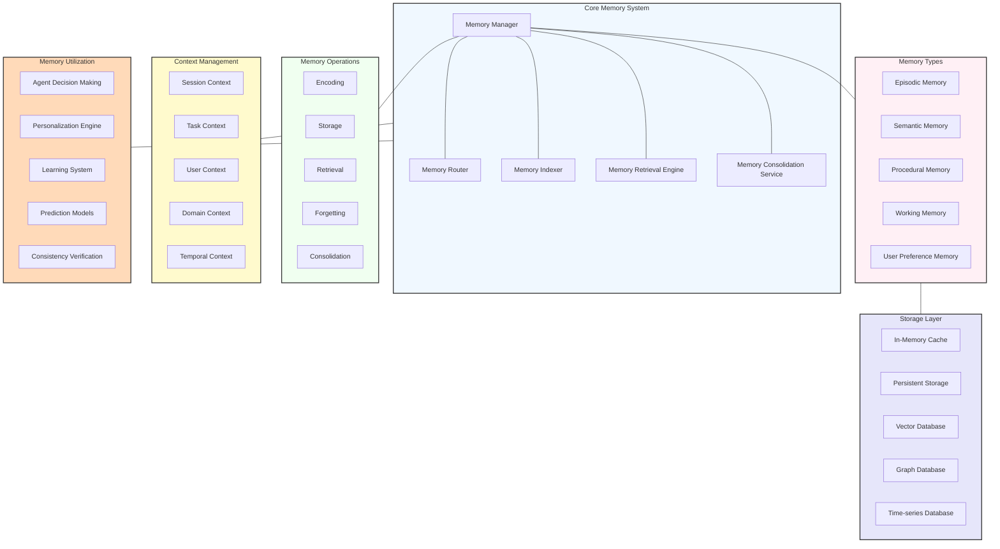

# Memory Management Architecture

This diagram illustrates the memory management architecture of the Agentic AI Job Search Assistant, showing how it maintains context and learns over time.

## Memory Management Architecture Details

The memory management architecture is a sophisticated system that enables the agent to maintain context, learn from experiences, and make informed decisions based on past interactions and outcomes. This cognitive architecture is inspired by human memory systems while being optimized for the specific requirements of an autonomous AI career assistant.

### Core Memory System
The central components managing all memory operations:

- **Memory Manager**: Orchestrates all memory operations across the system
  - Memory allocation
  - Priority management
  - Cross-memory coordination
  - Memory lifecycle management
  - Memory health monitoring

- **Memory Router**: Directs information to appropriate memory systems
  - Content type classification
  - Importance assessment
  - Memory system selection
  - Duplication detection
  - Cross-referencing

- **Memory Indexer**: Catalogs and organizes stored memories for efficient retrieval
  - Semantic indexing
  - Temporal indexing
  - Contextual tagging
  - Entity-based indexing
  - Relationship mapping

- **Memory Retrieval Engine**: Locates and returns relevant memories
  - Multi-criteria search
  - Relevance ranking
  - Fuzzy matching
  - Associative retrieval
  - Pattern-based search

- **Memory Consolidation Service**: Optimizes memory organization over time
  - Pattern recognition
  - Generalization
  - Redundancy elimination
  - Importance re-evaluation
  - Knowledge synthesis

### Memory Types
Different memory systems for various types of information:

- **Episodic Memory**: Records specific events and interactions
  - User interactions
  - Action sequences
  - Decision points
  - Outcomes and results
  - Temporal sequences

- **Semantic Memory**: Stores factual knowledge and concepts
  - Career domain knowledge
  - User profile information
  - Job market facts
  - Company information
  - Skill definitions

- **Procedural Memory**: Contains action patterns and procedures
  - Task workflows
  - Successful strategies
  - Process templates
  - Reusable routines
  - Best practices

- **Working Memory**: Maintains current context and active information
  - Current session state
  - Active tasks
  - Recent interactions
  - Pending decisions
  - Immediate context

- **User Preference Memory**: Stores user-specific preferences and patterns
  - Explicit preferences
  - Inferred preferences
  - Preference strength
  - Preference context
  - Preference history

### Memory Operations
Core processes for managing information in memory:

- **Encoding**: Transforms incoming information into memory structures
  - Format conversion
  - Feature extraction
  - Metadata attachment
  - Relevance assessment
  - Priority assignment

- **Storage**: Persists encoded information in appropriate memory systems
  - Format optimization
  - Duplication handling
  - Version management
  - Association creation
  - Integrity verification

- **Retrieval**: Accesses stored information based on current needs
  - Context-based search
  - Similarity matching
  - Category-based retrieval
  - Temporal proximity search
  - Associative chaining

- **Forgetting**: Strategically removes or de-prioritizes less valuable information
  - Importance-based retention
  - Time-based decay
  - Contradiction resolution
  - Obsolescence detection
  - Strategic summarization

- **Consolidation**: Reorganizes and optimizes memory structures
  - Pattern identification
  - Abstraction formation
  - Cross-reference creation
  - Knowledge integration
  - Structure optimization

### Context Management
Systems for maintaining relevant context across interactions:

- **Session Context**: Tracks information within the current interaction session
  - Active user goals
  - Recent exchanges
  - Session state
  - UI context
  - Current focus

- **Task Context**: Maintains information relevant to specific tasks
  - Task parameters
  - Task progress
  - Related resources
  - Dependencies
  - Success criteria

- **User Context**: Preserves understanding of the specific user
  - Career history
  - Skill profile
  - Behavioral patterns
  - Preference history
  - Interaction style

- **Domain Context**: Keeps track of career and job search domain specifics
  - Industry standards
  - Market conditions
  - Role expectations
  - Company contexts
  - Geographic factors

- **Temporal Context**: Manages time-related aspects of information
  - Sequence tracking
  - Trend analysis
  - Historical patterns
  - Seasonal factors
  - Future projections

### Storage Layer
Physical and logical storage mechanisms for memory:

- **In-Memory Cache**: High-speed access for frequently used information
  - Working memory contents
  - Recent interactions
  - Active session data
  - Frequent retrievals
  - Critical context

- **Persistent Storage**: Long-term storage for durable information
  - User profile data
  - Historical interactions
  - Application history
  - Document archives
  - Learning outcomes

- **Vector Database**: Optimized storage for embedding-based retrieval
  - Semantic representations
  - Similarity searching
  - Concept relationships
  - Natural language understanding
  - Pattern recognition

- **Graph Database**: Relationship-focused storage for connected information
  - Entity relationships
  - Career paths
  - Network connections
  - Dependency chains
  - Causal relationships

- **Time-series Database**: Specialized storage for temporal information
  - Sequential events
  - Trend data
  - Periodic patterns
  - Temporal correlations
  - Historical progressions

### Memory Utilization
Systems leveraging memory to enhance agent capabilities:

- **Agent Decision Making**: Uses memory to inform autonomous decisions
  - Past outcome analysis
  - Pattern recognition
  - Precedent identification
  - Context consideration
  - Risk assessment

- **Personalization Engine**: Tailors experiences based on user memory
  - Preference-based customization
  - Behavioral adaptation
  - Style matching
  - Context-specific personalization
  - Dynamic content adjustment

- **Learning System**: Improves agent performance based on memory
  - Success pattern identification
  - Failure analysis
  - Strategy refinement
  - Behavior optimization
  - Knowledge updating

- **Prediction Models**: Forecasts outcomes based on historical patterns
  - Job success prediction
  - Response time estimation
  - Strategy effectiveness projection
  - User behavior anticipation
  - Market trend forecasting

- **Consistency Verification**: Ensures coherent agent behavior over time
  - Cross-session consistency
  - Recommendation alignment
  - Advice coherence
  - Value consistency
  - Logical continuity

## Memory Management Principles

### Relevance
Memory systems prioritize relevant information:
- Context-sensitive importance scoring
- Goal-oriented memory organization
- Query-specific relevance ranking
- User-specific relevance models
- Tiered importance classification

### Adaptivity
Memory management adapts to changing requirements:
- Dynamic resource allocation
- Usage-based optimization
- Feedback-informed adjustments
- Load-responsive scaling
- Context-sensitive retrieval

### Efficiency
Memory operations balance performance with resource utilization:
- Tiered storage architecture
- Progressive encoding complexity
- Just-in-time retrieval
- Strategic forgetting
- Proactive caching

### Privacy
User data protection is fundamental:
- Memory isolation
- Permission-based access
- Retention policy enforcement
- Anonymization where appropriate
- Transparent memory usage

This comprehensive memory management architecture enables the agent to maintain context and continuity across interactions, learn from experience, and make increasingly effective decisions based on accumulated knowledge.
