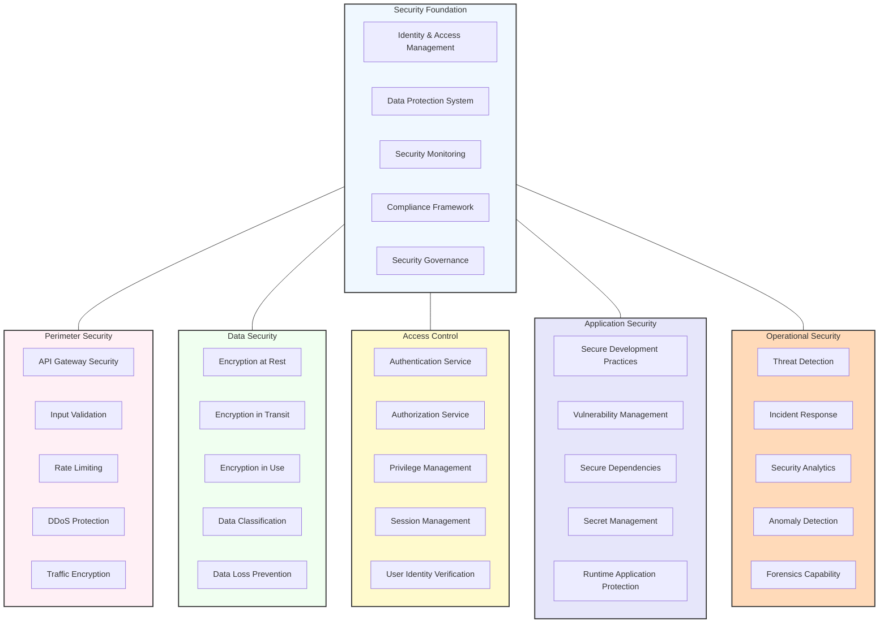

# Security Architecture

This diagram illustrates the security architecture of the Agentic AI Job Search Assistant, showing how it protects user data and ensures system integrity.

## Security Architecture Details

The security architecture implements a defense-in-depth approach, with multiple layers of security controls designed to protect user data, maintain system integrity, and ensure service availability. This comprehensive approach addresses security requirements across the entire system lifecycle.

### Security Foundation
The fundamental components supporting all security functions:

- **Identity & Access Management**: Core system for managing digital identities
  - Identity lifecycle management
  - Centralized authentication
  - Federated identity support
  - Privileged access management
  - Identity governance

- **Data Protection System**: Framework for comprehensive data security
  - Data protection policies
  - Protection mechanism orchestration
  - Compliance verification
  - Data sovereignty management
  - Third-party data handling

- **Security Monitoring**: Continuous oversight of security status
  - Real-time security event monitoring
  - Security information management
  - Alert correlation and analysis
  - Security metrics tracking
  - Continuous control verification

- **Compliance Framework**: Ensures adherence to regulatory requirements
  - Regulatory requirement mapping
  - Control implementation tracking
  - Compliance reporting
  - Gap remediation
  - Audit support

- **Security Governance**: Overall security management structure
  - Security policy management
  - Risk management framework
  - Security architecture oversight
  - Security training and awareness
  - Third-party security management

### Perimeter Security
Protects the system boundaries and external interfaces:

- **API Gateway Security**: Secures the API entry points
  - API authentication and authorization
  - Request validation
  - API abuse prevention
  - API versioning security
  - API request logging

- **Input Validation**: Ensures all incoming data is safe and valid
  - Schema validation
  - Content validation
  - Sanitization procedures
  - Type checking
  - Size limitation enforcement

- **Rate Limiting**: Prevents abuse through request throttling
  - Per-user rate limits
  - Per-IP rate limits
  - Adaptive rate limiting
  - Progressive penalties
  - Rate limit bypass protection

- **DDoS Protection**: Defends against distributed denial of service attacks
  - Traffic analysis
  - Attack pattern recognition
  - Traffic shaping
  - Automated mitigation
  - Fallback mechanisms

- **Traffic Encryption**: Secures data during transmission
  - TLS implementation
  - Certificate management
  - Protocol security
  - Cipher suite management
  - Forward secrecy

### Data Security
Protects data throughout its lifecycle:

- **Encryption at Rest**: Secures stored data
  - Database encryption
  - File system encryption
  - Backup encryption
  - Key management
  - Encryption algorithm management

- **Encryption in Transit**: Protects data during transmission
  - Point-to-point encryption
  - End-to-end encryption
  - Protocol security
  - Key exchange security
  - Certificate validation

- **Encryption in Use**: Protects data during processing
  - Memory protection
  - Secure enclaves
  - Confidential computing
  - Homomorphic encryption (where applicable)
  - Secure multi-party computation

- **Data Classification**: Categorizes data based on sensitivity
  - Automated data classification
  - Classification policy enforcement
  - Metadata tagging
  - Handling rules by classification
  - Classification review processes

- **Data Loss Prevention**: Prevents unauthorized data exposure
  - Content inspection
  - Contextual analysis
  - Policy enforcement
  - Activity monitoring
  - Blocking and alerting

### Access Control
Manages who can access what resources:

- **Authentication Service**: Verifies user identity
  - Multi-factor authentication
  - Single sign-on integration
  - Authentication strength adaptive to risk
  - Authentication attempt monitoring
  - Account recovery security

- **Authorization Service**: Controls access to resources
  - Role-based access control
  - Attribute-based access control
  - Just-in-time access
  - Principle of least privilege enforcement
  - Segregation of duties

- **Privilege Management**: Handles elevated access rights
  - Privileged account inventory
  - Just-in-time privilege elevation
  - Privilege usage monitoring
  - Separation of admin functions
  - Emergency access procedures

- **Session Management**: Secures user sessions
  - Secure session creation
  - Session timeout enforcement
  - Session attributes validation
  - Session fixation prevention
  - Concurrent session control

- **User Identity Verification**: Validates user identity claims
  - ID verification processes
  - Risk-based verification
  - Progressive identity proofing
  - Anti-fraud measures
  - Identity assertion validation

### Application Security
Ensures the security of application code and components:

- **Secure Development Practices**: Embeds security in development
  - Secure coding standards
  - Security code reviews
  - Static application security testing
  - Dynamic application security testing
  - Developer security training

- **Vulnerability Management**: Addresses security weaknesses
  - Vulnerability scanning
  - Vulnerability tracking
  - Patch management
  - Dependency vulnerability monitoring
  - Vulnerability prioritization

- **Secure Dependencies**: Ensures third-party code security
  - Dependency inventory
  - Dependency risk assessment
  - Automated dependency scanning
  - Version pinning and management
  - Abandoned dependency detection

- **Secret Management**: Secures credentials and secrets
  - Secure secret storage
  - Secret rotation
  - Access control to secrets
  - Secret usage auditing
  - Zero-knowledge proof where applicable

- **Runtime Application Protection**: Guards against attacks during execution
  - Runtime threat detection
  - Virtual patching
  - Behavior monitoring
  - Attack blocking
  - Runtime self-protection

### Operational Security
Addresses security during system operation:

- **Threat Detection**: Identifies potential security threats
  - Behavioral analysis
  - Signature-based detection
  - Heuristic detection
  - Threat intelligence integration
  - Advanced persistent threat detection

- **Incident Response**: Handles security incidents
  - Incident detection
  - Incident classification
  - Response orchestration
  - Containment procedures
  - Post-incident analysis

- **Security Analytics**: Analyzes security data for insights
  - Log analysis
  - User behavior analytics
  - Entity behavior analytics
  - Threat hunting
  - Risk scoring

- **Anomaly Detection**: Identifies unusual behavior
  - Baseline establishment
  - Deviation detection
  - Contextual analysis
  - False positive reduction
  - Alert generation

- **Forensics Capability**: Investigates security incidents
  - Event reconstruction
  - Evidence collection
  - Chain of custody maintenance
  - Root cause analysis
  - Remediation guidance

## Security Principles

### Defense in Depth
Multiple layers of security controls protect critical assets:
- Overlapping defense mechanisms
- No single point of failure
- Complementary controls
- Independent security layers
- Comprehensive coverage

### Least Privilege
Access is limited to the minimum required:
- Function-based access grants
- Time-limited privileges
- Context-aware access control
- Regular access review
- Default deny stance

### Data-Centric Security
Security follows the data regardless of location:
- End-to-end data protection
- Data lifecycle security
- Location-independent controls
- User-controlled encryption (where possible)
- Data sovereignty respect

### Privacy by Design
Privacy protection is built into the system:
- Data minimization
- Purpose limitation
- Storage limitation
- User control and transparency
- Privacy impact assessment

### Continuous Improvement
Security evolves to address emerging threats:
- Regular security testing
- Threat intelligence monitoring
- Control effectiveness measurement
- Incident-driven improvements
- Security architecture reviews

This comprehensive security architecture ensures that the Agentic AI Job Search Assistant protects user data while maintaining system integrity and availability, building a foundation of trust that is essential for an autonomous career assistant.
