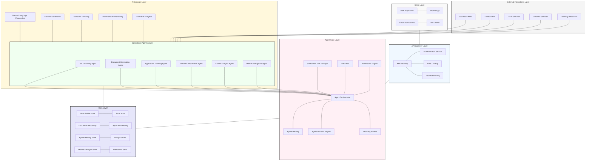

# System Architecture Overview

This diagram illustrates the high-level system architecture of the Agentic AI Job Search Assistant.

## Architectural Overview

The Agentic AI Job Search Assistant utilizes a modular, service-oriented architecture designed to enable autonomous operation while maintaining flexibility, scalability, and security. The architecture consists of several distinct layers, each with specific responsibilities.

### Client Layer
The presentation layer that provides user interfaces for interacting with the system:

- **Web Application**: Primary interface accessed through web browsers
- **Mobile App**: Native mobile applications for iOS and Android
- **Email Notifications**: Interactive email-based interface for notifications and quick actions
- **API Clients**: External client applications consuming the system's API

### API Gateway Layer
The entry point for all client interactions, providing:

- **API Gateway**: Unified entry point handling request routing and transformation
- **Authentication Service**: User authentication and authorization
- **Rate Limiting**: Request throttling to prevent abuse
- **Request Routing**: Direction of requests to appropriate services

### Agent Core Layer
The central nervous system of the autonomous agent platform:

- **Agent Orchestrator**: Coordinates activities across specialized agents
- **Agent Memory**: Short and long-term memory system for retaining context
- **Agent Decision Engine**: Makes autonomous decisions based on goals, constraints, and preferences
- **Learning Module**: Improves agent behavior based on feedback and outcomes
- **Scheduled Task Manager**: Handles recurring and time-based agent activities
- **Event Bus**: Manages asynchronous communication between system components
- **Notification Engine**: Controls user alerts across multiple channels

### Specialized Agents Layer
Domain-specific agents that handle particular aspects of the job search process:

- **Job Discovery Agent**: Finds and evaluates job opportunities
- **Document Generation Agent**: Creates and customizes resumes and cover letters
- **Application Tracking Agent**: Monitors application status and manages follow-ups
- **Interview Preparation Agent**: Generates interview content and provides feedback
- **Career Analysis Agent**: Analyzes skills, gaps, and career progression
- **Market Intelligence Agent**: Gathers and interprets job market trends

### AI Services Layer
Shared AI capabilities utilized by the specialized agents:

- **Natural Language Processing**: Text understanding and analysis
- **Content Generation**: Creation of customized documents and messages
- **Semantic Matching**: Matching between job requirements and user profiles
- **Document Understanding**: Extraction of structured data from documents
- **Predictive Analytics**: Forecasting job search outcomes and market trends

### Data Layer
Persistent storage for all system information:

- **User Profile Store**: Comprehensive user career information
- **Document Repository**: Storage for resumes, cover letters, and other documents
- **Agent Memory Store**: Persistent storage for agent context and learning
- **Market Intelligence DB**: Job market trends and analysis
- **Job Cache**: Recently processed job listings
- **Application History**: Comprehensive application status and history
- **Analytics Data**: System performance and user outcome metrics
- **Preference Store**: User preferences and settings

### External Integrations Layer
Connections to third-party services and data sources:

- **Job Board APIs**: Interfaces with LinkedIn, Indeed, Glassdoor, etc.
- **LinkedIn API**: Profile integration and professional network access
- **Email Services**: Email monitoring and sending capabilities
- **Calendar Services**: Interview scheduling and reminders
- **Learning Resources**: Connections to skill development platforms

## System Characteristics

### Autonomy
The system is designed to operate with varying levels of autonomy, from fully autonomous to user-guided mode, with the Agent Decision Engine managing the boundaries of autonomous action.

### Scalability
The modular architecture allows for horizontal scaling of individual components based on load, with stateless services and distributed data storage.

### Security
Multi-layered security approach:
- API Gateway security controls
- End-to-end encryption for sensitive data
- Fine-grained access controls
- Secure external integrations

### Extensibility
The system is designed for easy extension:
- New specialized agents can be added
- Additional AI services can be integrated
- External integrations can be expanded

### Resilience
Fault tolerance is built into the architecture:
- Redundant critical services
- Graceful degradation when components fail
- Comprehensive monitoring and alerting

This architecture enables the system to deliver a highly personalized, autonomous job search experience while maintaining flexibility for evolution and expansion.
