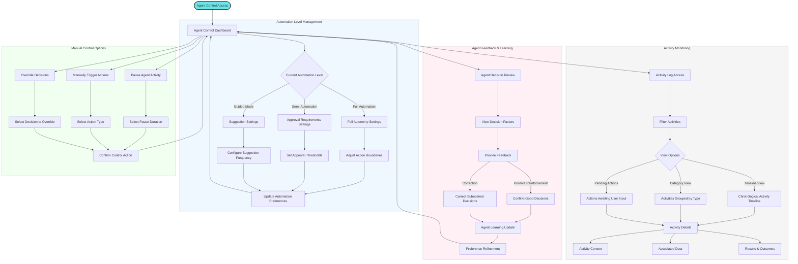

# Agent Control Flow

This diagram illustrates how users can control, monitor, and interact with the autonomous agent system of the AI Job Search Assistant.

## Detailed Process Description

### Agent Control Dashboard
1. **Dashboard Access**: Users access the agent control center from:
   - Main application dashboard
   - Settings menu
   - Notification interactions
   - Direct link in emails

2. **Dashboard Overview**: The control dashboard provides:
   - Current automation status
   - Recent agent activities
   - Pending approvals or decisions
   - Agent performance metrics
   - Quick control actions

### Automation Level Management
3. **Automation Level Selection**: Users choose from three primary automation models:
   - **Full Automation**: Agent operates autonomously with minimal user intervention
   - **Semi-Automation**: Agent performs research and preparation but seeks approval for major actions
   - **Guided Mode**: Agent suggests actions but user initiates execution

4. **Boundary Configuration**: For each automation level, users can set specific parameters:
   - **Action Boundaries**: Types of actions the agent can take independently
   - **Approval Thresholds**: Criteria determining when approval is required
   - **Suggestion Frequency**: How often and for what actions the agent makes suggestions

5. **Specific Controls**:
   - Job application submission limits
   - Document modification permissions
   - Communication authorization levels
   - Financial decision boundaries (for premium services)
   - Schedule management parameters

### Activity Monitoring
6. **Activity Logging**: Comprehensive record of all agent activities:
   - Job searches performed
   - Applications processed
   - Documents generated
   - Communications sent/received
   - Research conducted
   - Decisions made

7. **Activity Filtering**: Users can filter activities by:
   - Time period
   - Activity type
   - Status
   - Associated job/company
   - Importance level

8. **View Options**:
   - **Timeline View**: Chronological activity display
   - **Category View**: Activities grouped by type
   - **Pending Actions**: Items requiring user attention

9. **Activity Details**: For each activity, users can access:
   - Contextual information
   - Associated data and documents
   - Decision factors considered
   - Results and outcomes
   - Timestamp and duration

### Agent Feedback & Learning
10. **Decision Review**: Users can review agent decisions:
    - Job match evaluations
    - Application submissions
    - Document customizations
    - Interview preparation recommendations
    - Follow-up communications

11. **Decision Factors**: For each decision, users can see:
    - Factors the agent considered
    - Weighting of different criteria
    - Alternative options evaluated
    - Confidence level in the decision

12. **Feedback Mechanisms**:
    - **Positive Reinforcement**: Confirm good decisions to strengthen patterns
    - **Correction**: Guide the agent to better decisions in similar future scenarios
    - **Preference Updates**: Explicitly modify preference settings

13. **Learning Process**: The agent incorporates feedback through:
    - Preference refinement
    - Decision criteria adjustment
    - Pattern recognition updates
    - Priority recalibration

### Manual Control Options
14. **Direct Intervention**: Users can directly control agent behavior:
    - **Pause Activity**: Temporarily halt all or specific agent functions
    - **Manual Triggers**: Initiate specific agent actions on demand
    - **Decision Overrides**: Change or reverse agent decisions
    - **Emergency Stop**: Immediately halt all automated processes

15. **Control Parameters**:
    - Duration of pauses
    - Scope of manual actions
    - Override justification
    - Notification preferences

This flow demonstrates how the system balances powerful autonomous functionality with transparent, flexible user control. Users maintain ultimate authority while benefiting from the agent's efficiency, with the ability to adjust the balance according to their comfort level and needs.
