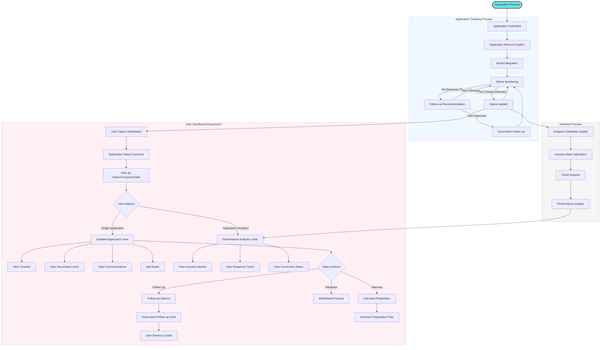

# Application Management Flow

This diagram illustrates how the Agentic AI Job Search Assistant tracks, analyzes, and manages job applications throughout their lifecycle.

## Detailed Process Description

### Application Initiation
1. **Application Submitted**: The process begins when an application is submitted:
   - Through the agent's automated process
   - Manually by the user outside the system
   - Via direct integration with job platforms

### Application Tracking Process
2. **Application Record Creation**: The system creates a detailed record:
   - Job details
   - Company information
   - Application date
   - Documents submitted
   - Initial status
   - Submission method

3. **Email Integration**: The system connects to the user's email to:
   - Monitor for application confirmations
   - Track employer communications
   - Detect interview invitations
   - Identify rejection notifications

4. **Status Monitoring**: The agent continuously monitors application status:
   - Submitted
   - Confirmed
   - Under Review
   - Interview Requested
   - Additional Information Requested
   - Offer Extended
   - Rejected
   - Withdrawn

5. **Status Updates**: When status changes are detected:
   - Record is updated
   - User is notified based on preferences
   - Timeline is extended
   - Next actions are suggested

6. **Follow-up Process**: For applications with no response:
   - The agent monitors time since submission
   - At appropriate intervals, follow-up is recommended
   - If approved, the agent drafts personalized follow-up messages
   - Messages are sent after user review or automatically (based on settings)

### Analytics Process
7. **Analytics Database Update**: Each application and status change updates the analytics database.

8. **Success Rate Calculation**: The system calculates various success rates:
   - Application to interview rate
   - Interview to offer rate
   - Overall success rate
   - Rates by industry, role type, company size, etc.

9. **Trend Analysis**: The system identifies patterns:
   - Response time trends
   - Successful application characteristics
   - Optimal follow-up timing
   - Seasonal patterns

10. **Performance Insights**: The system generates actionable insights:
    - Most effective resume versions
    - Most successful application strategies
    - Skill gaps impacting success
    - Improvement recommendations

### User Dashboard Experience
11. **Application Overview**: Users see a comprehensive view of all applications:
    - Status summary
    - Upcoming actions
    - Recent updates
    - Success metrics

12. **Filtering & Organization**: Users can organize applications by:
    - Status
    - Company
    - Date
    - Industry
    - Location
    - Priority

13. **Detailed Application View**: For each application, users can access:
    - Complete timeline
    - All communications
    - Documents submitted
    - Notes and reminders
    - Next steps

14. **Analytics View**: Users can analyze their job search performance:
    - Success metrics over time
    - Comparative performance
    - Trend visualizations
    - Improvement suggestions

15. **Action Options**: For each application, users can:
    - Generate follow-up messages
    - Withdraw applications
    - Prepare for interviews
    - Add notes or reminders
    - Update status manually

This flow demonstrates how the agent transforms application tracking from a disconnected, manual process into a comprehensive, insightful system that provides both detailed status monitoring and strategic performance analysis.
