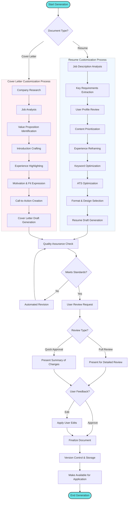

# Document Generation Flow

This diagram illustrates how the Agentic AI Job Search Assistant automatically generates customized application documents (resumes and cover letters) for specific job opportunities.

## Detailed Process Description

### Initialization
1. **Start Generation**: Process begins when:
   - User selects a job to apply for
   - Agent identifies a high-match opportunity
   - User manually requests document generation

2. **Document Type Selection**: The system determines which document(s) to generate:
   - Resume customization
   - Cover letter generation
   - Both documents as a package

### Resume Customization Process
3. **Job Description Analysis**: The agent thoroughly analyzes the job posting:
   - Required skills and qualifications
   - Preferred experiences
   - Company values and language
   - Role responsibilities

4. **Key Requirements Extraction**: The agent extracts and prioritizes key requirements.

5. **User Profile Review**: The agent reviews the user's complete profile:
   - Work history
   - Skills and competencies
   - Projects and achievements
   - Education and certifications

6. **Content Prioritization**: The agent determines which elements of the user's background to emphasize.

7. **Experience Reframing**: The agent repositions past experiences to align with the target role.

8. **Keyword Optimization**: The agent integrates relevant keywords and phrases from the job description.

9. **ATS Optimization**: The agent ensures the resume will perform well in applicant tracking systems.

10. **Format & Design Selection**: The agent selects an appropriate format:
    - Industry-appropriate
    - Reflects seniority level
    - Highlights strengths
    - Potentially masks weaknesses

11. **Resume Draft Generation**: The system generates a complete customized resume draft.

### Cover Letter Customization Process
12. **Company Research**: The agent gathers information about the company:
    - Mission and values
    - Recent news
    - Products and services
    - Company culture

13. **Job Analysis**: The agent analyzes job requirements and context.

14. **Value Proposition Identification**: The agent identifies the most compelling aspects of the user's background.

15. **Introduction Crafting**: The agent creates a personalized, engaging introduction.

16. **Experience Highlighting**: The agent selects and frames the most relevant user experiences.

17. **Motivation & Fit Expression**: The agent articulates why the user is interested and how they align with company values.

18. **Call-to-Action Creation**: The agent crafts an appropriate conclusion and call to action.

19. **Cover Letter Draft Generation**: The system generates a complete customized cover letter draft.

### Quality Assurance and Finalization
20. **Quality Assurance Check**: The system performs automated quality checks:
    - Grammar and spelling
    - Professional tone
    - Factual accuracy
    - Completeness
    - Format integrity

21. **Standard Verification**: The system determines if the document meets quality standards.

22. **User Review Request**: Based on user preferences, the system requests:
    - Full Review: Detailed review of the entire document
    - Quick Approval: Summary of key changes for rapid approval

23. **User Feedback Processing**: The system incorporates any user feedback or edits.

24. **Document Finalization**: The system finalizes the approved document.

25. **Version Control & Storage**: The system:
    - Assigns version information
    - Records metadata (associated job, date, customizations made)
    - Stores document securely
    - Updates document library

26. **Application Readiness**: The document is made available for the application process.

This flow demonstrates how the agent transforms the typically time-consuming document customization process into an efficient, high-quality automated system that still allows for user oversight and control.
