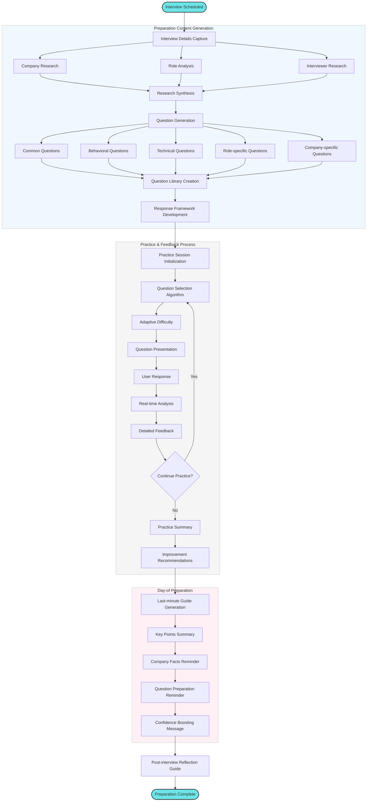

# Interview Preparation Flow

This diagram illustrates how the Agentic AI Job Search Assistant provides comprehensive interview preparation tailored to specific job opportunities.

## Detailed Process Description

### Interview Setup
1. **Interview Scheduled**: Process begins when:
   - An interview is scheduled through the application
   - User manually adds an interview to the system
   - The agent detects an interview invitation in email

2. **Interview Details Capture**: The system records:
   - Company and role
   - Interview date, time, and format
   - Interviewer names and titles (if available)
   - Interview stage (initial, technical, final, etc.)
   - Any provided preparation instructions

### Preparation Content Generation
3. **Research Phase**: The agent gathers comprehensive information:
   - **Company Research**: History, culture, recent news, products/services, challenges
   - **Role Analysis**: Key responsibilities, required skills, success metrics, team structure
   - **Interviewer Research**: Background, role, interests (if publicly available)

4. **Research Synthesis**: The agent processes research to identify:
   - Key talking points
   - Company values alignment
   - Recent developments to mention
   - Potential challenges to address

5. **Question Generation**: The agent creates a comprehensive question library:
   - **Common Questions**: Standard interview questions
   - **Behavioral Questions**: STAR-method questions based on job requirements
   - **Technical Questions**: Role-specific technical assessments
   - **Role-specific Questions**: Questions targeting key responsibilities
   - **Company-specific Questions**: Questions relating to company culture and challenges

6. **Response Framework Development**: For each question type, the agent creates:
   - Optimal response structures
   - Key points to include
   - Examples from user's background
   - Effective phrasing suggestions
   - Pitfalls to avoid

### Practice & Feedback Process
7. **Practice Session Initialization**: User begins interactive practice.

8. **Question Selection Algorithm**: The system selects questions based on:
   - Relevance to specific interview
   - User's past performance
   - Areas needing improvement
   - Comprehensive coverage of topics

9. **Adaptive Difficulty**: The system adjusts question difficulty based on user performance.

10. **Practice Interaction**:
    - The system presents questions in interview format
    - User provides verbal or written responses
    - The system analyzes responses in real-time
    - The system provides detailed feedback:
      - Content completeness
      - Structure and clarity
      - Alignment with expectations
      - Specific improvement suggestions
    
11. **Practice Summary**: After session completion:
    - Overall performance assessment
    - Strengths identification
    - Improvement areas
    - Progress tracking from previous sessions

12. **Improvement Recommendations**: Personalized guidance for continued preparation:
    - Specific responses to refine
    - Additional topics to research
    - Communication adjustments
    - Confidence-building techniques

### Final Preparation
13. **Day-of Preparation**: Just before the interview, the system provides:
    - **Last-minute Guide**: Focused preparation priorities
    - **Key Points Summary**: Critical talking points
    - **Company Facts**: Important details to remember
    - **Question Preparation**: Reminder of challenging questions
    - **Confidence Boosting**: Personalized encouragement

14. **Post-interview Process**:
    - **Reflection Guide**: Structured format to capture interview details
    - **Response Assessment**: Analysis of what went well/poorly
    - **Follow-up Recommendations**: Suggestions for thank-you notes
    - **Feedback Integration**: System learning from interview outcomes

This flow demonstrates how the agent transforms interview preparation from an unstructured, anxiety-inducing process into a comprehensive, personalized system that significantly improves interview performance and confidence.
