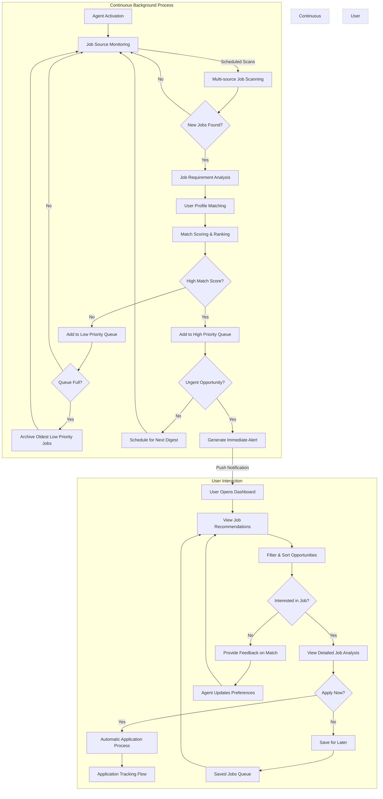

# Autonomous Job Discovery Flow

This diagram illustrates how the Agentic AI Job Search Assistant continuously discovers, evaluates, and presents job opportunities to the user.

## Detailed Process Description

### Continuous Background Process
The agent operates continuously in the background, monitoring and processing job opportunities even when the user is not actively engaged with the application.

1. **Job Source Monitoring**: The agent maintains connections to multiple job sources:
   - Job boards (LinkedIn, Indeed, Glassdoor, etc.)
   - Company career pages
   - Recruiter networks
   - Professional associations
   - Email job alerts

2. **Multi-source Job Scanning**: At scheduled intervals, the agent scans for new opportunities across all sources.

3. **Job Requirement Analysis**: For each new job found, the agent analyzes:
   - Required skills and experience
   - Company details and culture
   - Compensation details (if available)
   - Location and remote options
   - Application deadlines
   
4. **User Profile Matching**: The agent compares job requirements against the user's profile:
   - Skills alignment
   - Experience fit
   - Career goal compatibility
   - Location preferences
   - Compensation expectations
   
5. **Match Scoring & Ranking**: Each opportunity receives a composite match score based on multiple factors.

6. **Opportunity Prioritization**:
   - **High Priority Queue**: Strong matches (typically 85%+ match score)
   - **Low Priority Queue**: Moderate matches for later consideration
   - **Urgent Opportunities**: Time-sensitive positions with high match scores

### User Interaction
The user interface presents discovered opportunities in an organized, actionable format.

1. **Dashboard View**: User accesses personalized job recommendations
2. **Filtering & Sorting**: User can refine the view based on various criteria
3. **Interest Assessment**: User indicates interest or disinterest in specific positions
4. **Detailed Analysis**: For interesting positions, the agent provides in-depth analysis:
   - Match details (which aspects of the user's profile match well)
   - Potential skill gaps
   - Company insights
   - Estimated competition level
   - Application success probability
   
5. **Action Options**:
   - **Apply Now**: Initiates automated application process with customized materials
   - **Save for Later**: Adds to saved jobs queue for future consideration
   - **Provide Feedback**: User feedback improves future matching accuracy

6. **Preference Learning**: The agent continuously refines its understanding of user preferences based on interactions.

This flow demonstrates how the agent maintains constant vigilance in job discovery while minimizing user effort in finding relevant opportunities.
