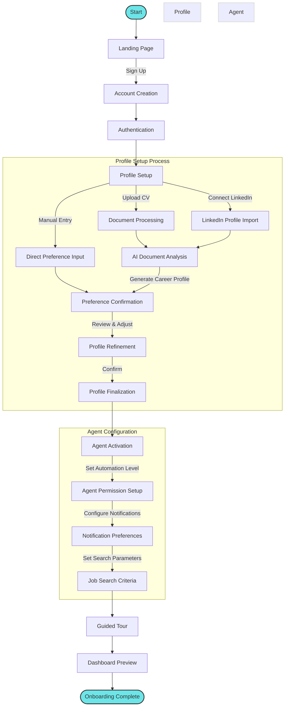

# User Onboarding Flow

This diagram illustrates the user onboarding process for the Agentic AI Job Search Assistant.

## Detailed Process Description

### Initial Access
1. **Landing Page**: User encounters the system's landing page highlighting key features
2. **Account Creation**: User creates an account with email or social login
3. **Authentication**: User completes authentication process

### Profile Setup Process
4. **Profile Setup Options**:
   - **Upload CV**: User uploads resume/CV document(s)
   - **Connect LinkedIn**: User authorizes LinkedIn profile access
   - **Manual Entry**: User manually enters career information
   
5. **AI Document Analysis**: The system automatically processes documents to extract:
   - Skills and competencies
   - Work history and achievements
   - Education and certifications
   - Career trajectory

6. **Preference Confirmation**: The system presents extracted information for user confirmation
7. **Profile Refinement**: User reviews AI-generated insights and makes adjustments
8. **Profile Finalization**: User confirms the final career profile

### Agent Configuration
9. **Agent Activation**: The autonomous agent system is initialized
10. **Agent Permission Setup**: User configures automation levels:
    - Full automation (agent acts independently)
    - Semi-automation (agent requests approval for key actions)
    - Guided mode (agent suggests but user initiates actions)
    
11. **Notification Preferences**: User sets communication preferences
12. **Job Search Criteria**: User confirms initial job search parameters

### Orientation
13. **Guided Tour**: Interactive walkthrough of key features
14. **Dashboard Preview**: Preview of personalized dashboard with initial agent insights

The onboarding process emphasizes minimal user effort with maximum data collection, setting the stage for highly personalized autonomous operation.
